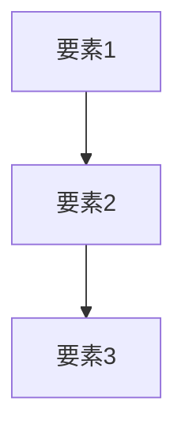

# 記事テンプレート

新しい記事を作成する際は、このテンプレートに従ってください。

---

# [概念名・フレームワーク名]

## 導入問題

> [日常の疑問や考えさせる問いかけを記述]
>
> 例：「今日の100円と明日の100円、どちらが価値があると思いますか？」

## 考えるポイント

- [回答を導くためのヒントや視点を箇条書きで記述]
- [複数の観点から考えられるよう促す]

## 解説

### 用語定義

[概念やフレームワークの定義を簡潔に記述]

### 背景・なぜ重要か

[この概念が生まれた背景や、なぜビジネスで重要なのかを説明]

## 詳細説明

[理論やフレームワークの詳細を説明]

[必要に応じてMermaid図を使用]

## 具体例・ケーススタディ

### 例1：[具体例のタイトル]

[実際のビジネスシーンでの適用例を記述]

### 例2：[具体例のタイトル]

[別の適用例があれば記述]

## 関連概念

- [関連する概念へのリンク](../カテゴリ/概念名.md)
- [関連する概念へのリンク](../カテゴリ/概念名.md)

## 参考文献

- [書籍名や論文名]（著者名、出版年）
- [Webリソース](URL)

---

## テンプレート使用上の注意

1. **導入問題は必須**: 日常に根ざした問いから始める
2. **Mermaid図は積極活用**: フレームワークは視覚化すると理解しやすい
3. **具体例は実務に即したもの**: 抽象的な説明だけでなく、実際に使える形で
4. **関連概念でつなげる**: 知識のネットワークを構築
5. **参考文献は任意**: 必要に応じて記載
