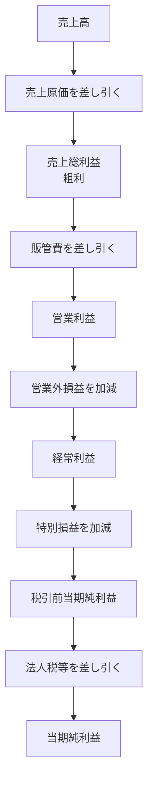
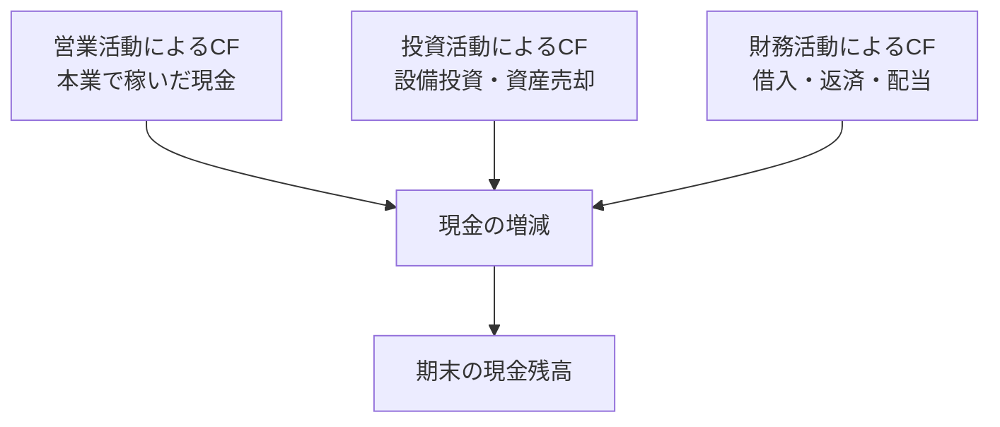
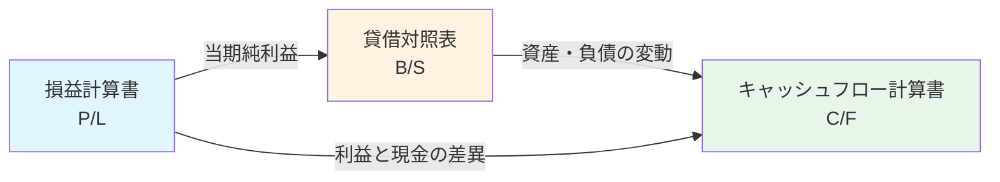

# 財務三表

## 導入問題

> 企業の健康診断書といえる財務資料を見るとき、あなたはどこに注目しますか?
>
> 売上や利益だけで企業の状態を判断できるでしょうか？

## 考えるポイント

- 企業のお金の流れには、利益だけでなく資産や負債、実際のキャッシュの動きなど、さまざまな側面がある
- 1つの指標だけでは企業の全体像は見えない
- 企業の過去・現在・未来を総合的に理解するには、複数の視点が必要

## 解説

### 用語定義

**財務三表**とは、企業の財務状況を表す3つの基本的な財務諸表のことです。

1. **損益計算書（P/L: Profit and Loss Statement）**: 企業の経営成績を示す
2. **貸借対照表（B/S: Balance Sheet）**: 企業の財政状態を示す
3. **キャッシュフロー計算書（C/F: Cash Flow Statement）**: 企業の資金の流れを示す

### 背景・なぜ重要か

財務三表は、企業を多面的に理解するために生まれました。
利益が出ていても資金繰りが厳しい企業や、資産は多いが収益性が低い企業など、単一の視点では見えない問題を発見できます。
投資家、債権者、経営者にとって、意思決定の基盤となる重要な情報源です。

## 詳細説明

### 1. 損益計算書（P/L）

企業が一定期間にどれだけ稼いで、どれだけコストをかけ、最終的にどれだけ利益を出したかを示します。

<!-- textlint-disable -->

<!-- textlint-enable -->

**主な項目**
- **売上高**: 企業の本業による収益
- **売上原価**: 商品やサービスを提供するための直接コスト
- **売上総利益（粗利）**: 売上高 - 売上原価
- **営業利益**: 本業での儲け
- **経常利益**: 本業＋財務活動を含めた通常の儲け
- **当期純利益**: 最終的な利益

### 2. 貸借対照表（B/S）

ある時点での企業の財政状態を示します。
企業が何を持っていて（資産）、誰からお金を借りていて（負債）、株主の持分はどれだけか（純資産）を表します。

<!-- textlint-disable -->
```mermaid
graph LR
    subgraph 資産の部
        A1[流動資産<br/>現金・売掛金など]
        A2[固定資産<br/>土地・建物・設備など]
    end

    subgraph 負債・純資産の部
        B1[流動負債<br/>買掛金・短期借入金など]
        B2[固定負債<br/>長期借入金・社債など]
        B3[純資産<br/>資本金・利益剰余金など]
    end

    A1 -.調達先.- B1
    A2 -.調達先.- B2
    A1 -.調達先.- B3
    A2 -.調達先.- B3
```
<!-- textlint-enable -->

**基本の等式**
```
資産 = 負債 + 純資産
```

**主な項目**
- **流動資産**: 1年以内に現金化できる資産（現金、売掛金、棚卸資産など）
- **固定資産**: 長期間保有する資産（土地、建物、機械設備など）
- **流動負債**: 1年以内に返済する必要がある負債（買掛金、短期借入金など）
- **固定負債**: 返済期限が1年を超える負債（長期借入金、社債など）
- **純資産**: 株主の持分（資本金、利益剰余金など）

### 3. キャッシュフロー計算書（C/F）

企業の現金の増減を3つの活動に分けて示します。
利益と実際の現金の動きは異なるため、企業の資金繰りを理解する上で重要です。

<!-- textlint-disable -->

<!-- textlint-enable -->

**主な項目**
- **営業活動によるキャッシュフロー**: 本業から得られる現金の増減
- **投資活動によるキャッシュフロー**: 設備投資や有価証券の売買による現金の増減
- **財務活動によるキャッシュフロー**: 借入や返済、配当金の支払いなどによる現金の増減

### 財務三表の相互関係

財務三表は独立しているのではなく、密接に関連しています。

<!-- textlint-disable -->

<!-- textlint-enable -->

**つながりの例**
- P/Lで計上された当期純利益は、B/Sの純資産（利益剰余金）に加算される
- B/Sの現金残高の変動は、C/Fで詳細に説明される
- P/Lの減価償却費は現金支出を伴わないため、C/Fで調整される

## 具体例・ケーススタディ

### 例1：成長中のスタートアップ企業

**P/L**: 売上は順調に伸びており、前年比150%の成長。しかし、人件費や広告費の増加により営業利益は赤字。

**B/S**: 資産の多くは現金と売掛金。負債は主に短期借入金。ベンチャーキャピタルからの出資により純資産は増加。

**C/F**: 営業活動によるキャッシュフローはマイナス（赤字のため）。財務活動によるキャッシュフローは大幅なプラス（資金調達）。

**総合判断**: 利益は出ていないが、資金調達により成長投資を継続できている。キャッシュが尽きる前に黒字化できるかが課題。

### 例2：成熟した製造業企業

**P/L**: 安定した売上と営業利益を計上。売上成長率は低いが、高い利益率を維持。

**B/S**: 土地・建物・機械設備などの固定資産が多い。長期借入金はあるが、自己資本比率は高い。

**C/F**: 営業活動によるキャッシュフローは安定してプラス。投資活動によるキャッシュフローは設備更新のためマイナス。財務活動によるキャッシュフローは配当金支払いによりマイナス。

**総合判断**: 本業で安定的に現金を生み出し、適度な設備投資と株主還元を実施。財務的に健全な状態。

## 財務分析の基本的な視点

財務三表から企業を分析する際の主な視点：

1. **収益性**: 利益をどれだけ効率的に生み出しているか（P/L中心）
   - 売上高の営業利益率、ROE（自己資本の利益率）など

2. **安全性**: 倒産リスクはどの程度か（B/S中心）
   - 自己資本比率、流動比率など

3. **成長性**: 企業はどれだけ成長しているか（P/L・B/Sの時系列比較）
   - 売上高成長率、総資産成長率など

4. **効率性**: 資産をどれだけ効率的に活用しているか（P/LとB/Sの組み合わせ）
   - 総資産回転率、在庫回転率など

5. **キャッシュ創出力**: 実際にどれだけ現金を生み出しているか（C/F中心）
   - フリーキャッシュフロー、営業キャッシュフローマージンなど

## 関連概念

- [正味現在価値](../ファイナンス/正味現在価値.md)
- [ROE（自己資本利益率）](../アカウンティング/ROE.md)
- [財務分析](../アカウンティング/財務分析.md)

## 参考文献

- 『財務3表一体理解法』（國貞克則、朝日新聞出版、2007年）
- 『ざっくり分かるファイナンス』（石野雄一、光文社新書、2007年）
