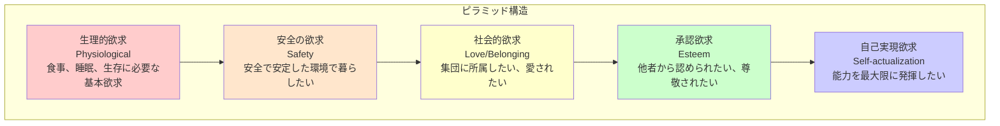

# マズローの欲求階層説

## 導入問題

> あなたの部下が最近、仕事に対するモチベーションが低下しているようです。
> 給与は業界水準で十分に支払っているのに、なぜやる気が出ないのでしょうか？
> 人を動かす要因は、お金だけではないのです。

## 考えるポイント

- 人が仕事に求めるものは何でしょうか
- 給与以外にどのような要素が従業員を動機づけるでしょうか
- 人の欲求には順序や優先度があるのでしょうか
- 基本的な生活が満たされた後、人は何を求めるのでしょうか

## 解説

### 用語定義

**マズローの欲求階層説（Maslow's Hierarchy of Needs）**は、心理学者アブラハム・マズローが1943年に提唱した、人間の欲求を5段階のピラミッド構造で表した理論です。
人間の欲求は低次から高次へと段階的に発展し、下位の欲求が満たされると、次の段階の欲求が動機づけ要因になるとされています。

### 背景・なぜ重要か

この理論は、人間行動を理解する上での基本的なフレームワークとして、経営学、マーケティング、組織マネジメントなど幅広い分野で活用されています。
特に、従業員のモチベーション管理やリーダーシップにおいて、「何が人を動かすのか」を理解するための重要な視点を提供します。

## 詳細説明

マズローは人間の欲求を以下の5段階に分類しました。

<!-- textlint-disable -->

<!-- textlint-enable -->

### 1. 生理的欲求（Physiological Needs）

最も基本的な欲求で、生命を維持するために必要なものです。
食事、水、睡眠、呼吸などが含まれます。
この欲求が満たされない限り、他の欲求は意識されにくくなります。

**ビジネスでの応用**
- 適切な給与水準の確保
- 休憩時間や休暇の保証
- 快適な作業環境（空調、照明など）

### 2. 安全の欲求（Safety Needs）

身体的・経済的な安全を求める欲求です。
危険から守られ、安定した生活を送りたいという欲求が含まれます。

**ビジネスでの応用**
- 雇用の安定性
- 安全な職場環境
- 健康保険や年金などの福利厚生
- 明確なルールや規則

### 3. 社会的欲求（Love and Belonging Needs）

人との関わりや所属を求める欲求です。
友情、愛情、集団への帰属感などが含まれます。

**ビジネスでの応用**
- チームワークの促進
- 社内コミュニケーションの活性化
- 社内イベントや懇親会
- 良好な職場の人間関係づくり

### 4. 承認欲求（Esteem Needs）

他者から認められ、尊敬されたいという欲求です。
自尊心、達成感、他者からの評価などが含まれます。

**ビジネスでの応用**
- 業績評価と表彰制度
- 昇進・昇格の機会
- 責任あるポジションの付与
- 成果に対するフィードバック

### 5. 自己実現欲求（Self-actualization Needs）

自分の可能性を最大限に発揮したいという欲求です。
創造性、問題解決、自己成長などが含まれます。
マズローは、この段階に到達する人は少ないとしています。

**ビジネスでの応用**
- 挑戦的なプロジェクトの機会
- スキル開発や研修プログラム
- 裁量権の拡大
- イノベーションを促す環境

## 具体例・ケーススタディ

### 例1：新入社員のモチベーション管理

新入社員のAさんは、入社当初は不安を感じていました（安全の欲求）。
メンター制度によって先輩社員とつながり、チームに溶け込むことができました（社会的欲求）。
その後、小さなプロジェクトで成果を出し、上司から評価されたことで自信がつきました（承認欲求）。
現在は、より大きなプロジェクトに挑戦し、自分の成長を実感しています（自己実現欲求）。

このように、段階的に欲求が満たされることで、モチベーションが向上していきます。

### 例2：給与だけでは解決しない離職問題

B社では、業界トップクラスの給与を支払っているにもかかわらず、離職率が高いという問題がありました。
調査の結果、従業員は「評価されていない」「成長の機会がない」と感じていることが判明しました。
生理的欲求や安全の欲求は満たされていましたが、承認欲求や自己実現欲求が満たされていなかったのです。

B社は評価制度を見直し、キャリア開発プログラムを導入することで、離職率の改善に成功しました。

## 理論の限界と批判

マズローの欲求階層説は広く受け入れられている一方で、いくつかの批判もあります。

### 1. 段階的進行の固定性

すべての人が必ずしも下位から順番に欲求を満たしていくわけではありません。
例えば、芸術家が生活の安定（安全の欲求）よりも創作活動（自己実現欲求）を優先する場合があります。

### 2. 文化的差異

この理論は西洋の個人主義的な価値観に基づいており、集団主義的な文化圏では必ずしも当てはまらない場合があります。
例えば、日本や東アジアでは、自己実現よりも集団への貢献を重視する傾向があります。

### 3. 実証研究の不足

マズロー自身は臨床観察に基づいて理論を構築しましたが、厳密な実証研究による検証は十分に行われていません。

### 4. 複数の欲求の同時存在

実際には、人は複数の段階の欲求を同時に持ち、それらが複雑に絡み合って行動を動機づけています。

## 現代的な応用

批判はあるものの、この理論は現代のビジネスシーンでも有用なフレームワークとして活用できます。

- **段階ではなく要素として理解する**: 欲求を厳密な段階ではなく、人を動機づける複数の要素として捉える
- **個人差を考慮する**: 一人一人が異なる欲求階層にいることを認識し、個別対応する
- **定期的な確認**: 従業員の欲求は時間とともに変化するため、定期的な対話が重要

## 関連概念

- [ハーズバーグの二要因理論](./ハーズバーグの二要因理論.md)（衛生要因と動機づけ要因）
- [マクレガーのX理論・Y理論](./マクレガーのX理論・Y理論.md)（人間観と管理スタイル）
- [内発的動機づけ](./内発的動機づけ.md)（自己決定理論）

## 参考文献

- Maslow, A. H. (1943). "A Theory of Human Motivation". *Psychological Review*, 50(4), 370-396.
- Maslow, A. H. (1954). *Motivation and Personality*. New York: Harper & Row.
- 金井壽宏 (2004). 『リーダーシップ入門』. 日経文庫.
