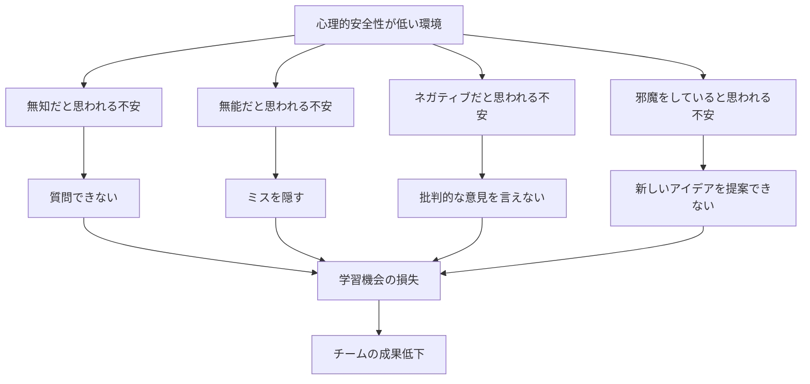
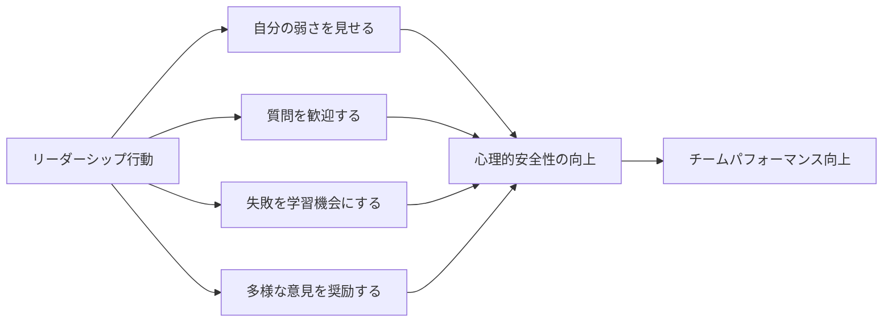

# 心理的安全性

## 導入問題

> あなたのチームで会議中、疑問に思ったことがあってもなかなか質問できない雰囲気を感じたことはありませんか？
>
> もしくは、失敗を恐れて新しいアイデアを提案できないと感じたことはありますか？

## 考えるポイント

- 優秀な人材を集めても、成果を出せないチームがあるのはなぜでしょうか？
- メンバーが意見を言いやすいチームと、言いにくいチームでは何が違うのでしょうか？
- 失敗を恐れずにチャレンジできる環境は、どうすれば作れるのでしょうか？

## 解説

### 用語定義

**心理的安全性（Psychological Safety）** とは、対人関係においてリスクのある行動を取っても、このチームでは安全であるという信念がチーム内で共有されている状態のことです。

ハーバード大学のエイミー・エドモンドソン教授が提唱した概念で、「無知、無能、ネガティブ、邪魔だと思われる可能性のある行動をしても、このチームなら大丈夫だ」という確信を持てる状態を指します。

### 背景・なぜ重要か

Googleが実施した「プロジェクト・アリストテレス」という大規模な研究により、心理的安全性がチームの生産性を高める最も重要な要因であることが明らかになりました。

優れたチームを作るには、誰がメンバーであるか（Who）よりも、チームがどのように協力しているか（How）の方が重要であり、その中核にあるのが心理的安全性なのです。

心理的安全性が高い環境では、以下のような効果が得られます。

- メンバーが積極的に発言し、多様な視点が集まる
- 早期に問題が発見され、迅速に対処できる
- 失敗から学ぶ文化が醸成され、イノベーションが生まれやすい
- メンバーの学習意欲とエンゲージメントが向上する

## 詳細説明

### 心理的安全性の4つの不安

エドモンドソン教授は、心理的安全性が低い環境では、人は以下の4つの不安を感じると指摘しています。

<!-- textlint-disable -->

<!-- textlint-enable -->

### 心理的安全性が高いチームの特徴

心理的安全性が高いチームには、以下のような特徴が見られます。

- **発言機会の平等**: 特定の人だけでなく、全員が均等に発言している
- **建設的な対立**: 意見の相違を恐れず、健全な議論が行われる
- **失敗の共有**: ミスを隠さず、学びの機会として共有される
- **相互理解**: メンバー同士が互いの背景や強みを理解している
- **助け合い**: 困っている人がいれば、自然とサポートが生まれる

### 心理的安全性が低いチームの特徴

一方、心理的安全性が低いチームでは、以下のような問題が起こりがちです。

- **沈黙の文化**: 会議で発言する人が限られている
- **表面的な合意**: 本音を言わず、その場では同意してしまう
- **ブレーミング**: 問題が起きると犯人探しが始まる
- **情報の隠蔽**: 悪いニュースが上がってこない
- **離職率の上昇**: 優秀な人材から辞めていく

## 心理的安全性を高める方法

### リーダーの行動指針

心理的安全性を高めるには、特にリーダーの行動が重要です。

<!-- textlint-disable -->

<!-- textlint-enable -->

#### 1. 自分の弱さや不確実性を認める

リーダー自身が「わからない」「助けてほしい」と素直に言うことで、メンバーも安心して弱みを見せられるようになります。

#### 2. 積極的に質問を促す

「他に質問は？」ではなく、「この点について、皆さんの考えはどうですか？」と具体的に問いかけることで、発言しやすい雰囲気を作ります。

#### 3. 失敗を責めず、学びの機会とする

ミスが起きたときに「なぜ起きたのか」を責めるのではなく、「次にどうすれば防げるか」に焦点を当てます。

#### 4. 反対意見を歓迎する

「異なる視点はないか？」と積極的に求め、反対意見を出した人に感謝を伝えることで、建設的な議論が生まれます。

### チーム全体での取り組み

#### チェックイン

会議の冒頭で、仕事以外の簡単な話題（最近の出来事など）を共有し、メンバー同士の理解を深めます。

#### 振り返りの実践

定期的に「うまくいったこと」「改善できること」を振り返り、チームの学習サイクルを回します。

#### 感謝の表明

メンバー同士で助け合ったことや、良い貢献をしたことを認め合う文化を作ります。

## 具体例・ケーススタディ

### 例1：Googleのプロジェクト・アリストテレス

Googleは2012年から数年間、180以上のチームを調査し、効果的なチームの条件を研究しました。

当初は「優秀なメンバーを集めれば良いチームになる」という仮説がありましたが、結果は意外なものでした。誰がメンバーであるかよりも、どのように協力しているかの方が重要だったのです。

最も重要な要素として特定されたのは心理的安全性でした。次いで、相互信頼、構造と明確さ、仕事の意味、インパクトの5つが挙げられました。その中でも、心理的安全性は圧倒的に重要であることが判明しました。

### 例2：医療現場での心理的安全性

エドモンドソン教授の初期の研究は、病院での医療ミスに関するものでした。

研究の結果、優れた医療チームほど多くのミスを報告していることがわかりました。これは、実際にミスが多いのではなく、心理的安全性が高いためにミスを隠さず報告できていたのです。

ミスを報告しやすい文化があることで、同じ失敗が繰り返されることを防ぎ、結果として患者の安全性が向上しました。

### 例3：ソフトウェア開発チーム

あるソフトウェア開発チームでは、新しいメンバーが「初歩的な質問ですが」という前置きなしで質問できるようになることを目標としました。

リーダーが率先して「自分も最近まで知らなかった」と発言したり、「良い質問ですね」と肯定的なフィードバックを返すことで、数ヶ月後にはチーム全体で活発な質問と議論が行われるようになりました。

その結果、コードレビューの質が向上し、バグの早期発見につながりました。

## よくある誤解

### 誤解1：「仲が良い = 心理的安全性が高い」

心理的安全性は、単なる仲の良さやなれ合いとは異なります。むしろ、建設的な対立や率直なフィードバックができる関係性を指します。

### 誤解2：「厳しいフィードバックができない」

心理的安全性が高い環境では、むしろ率直で建設的なフィードバックが可能になります。相手を尊重しながらも、改善点を明確に伝えられる関係性が重要です。

### 誤解3：「すぐに作れる」

心理的安全性は一朝一夕には築けません。リーダーとメンバーの継続的な努力と、日々の小さな行動の積み重ねが必要です。

## 関連概念

- [信頼](信頼.md)
- [フィードバック](フィードバック.md)
- [リーダーシップ](../リーダーシップ.md)

## 参考文献

- エイミー・C・エドモンドソン『恐れのない組織——「心理的安全性」が学習・イノベーション・成長をもたらす』（2021年、英治出版）
- Google re:Work「効果的なチームとは何か」を知る
- Charles Duhigg "What Google Learned From Its Quest to Build the Perfect Team" (2016)
