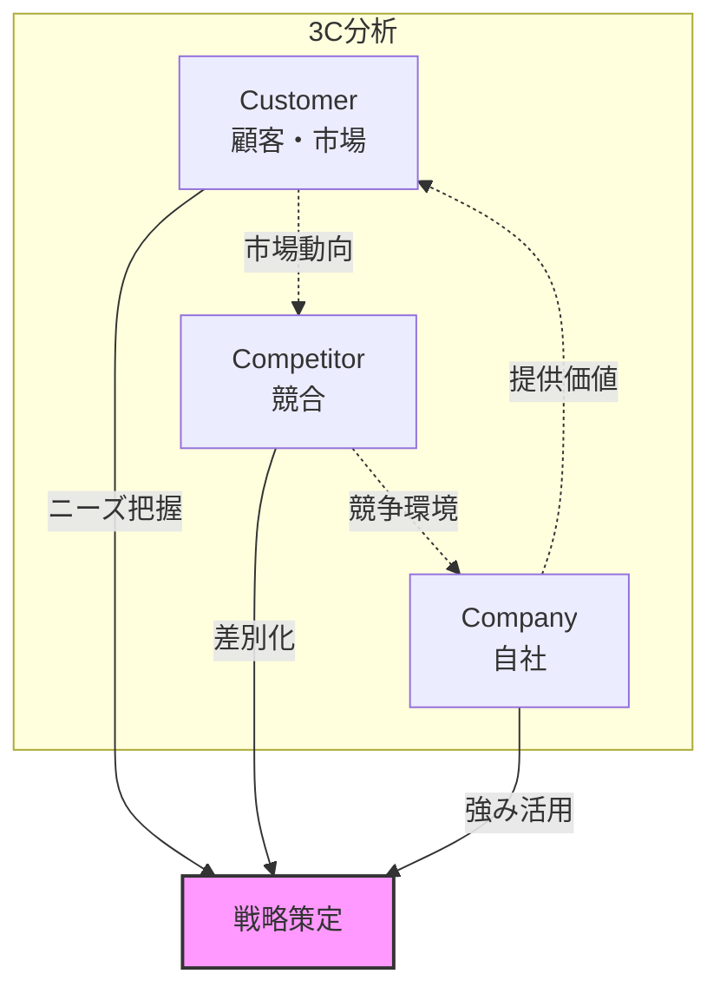
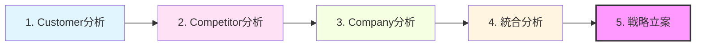

# 3C分析

## 導入問題

> 新商品を市場に投入する際、あなたはまず何を調べますか？
>
> 競合他社の動向でしょうか。それとも顧客のニーズでしょうか。あるいは自社の強みでしょうか。

## 考えるポイント

- 市場で成功するためには、どのような視点での分析が必要でしょうか
- 顧客、競合、自社の3つの視点は、どのように関連しているでしょうか
- これらの要素を総合的に見ることで、どのような戦略が見えてくるでしょうか

## 解説

### 用語定義

3C分析とは、マーケティング戦略を立案する際の基本的な環境分析フレームワークです。
Customer（顧客・市場）、Competitor（競合）、Company（自社）の3つの視点から市場環境を分析し、成功要因を見出します。

経営コンサルタントの大前研一氏が提唱したこのフレームワークは、戦略立案の出発点として広く活用されています。

### 背景・なぜ重要か

ビジネスの成功は、顧客ニーズを満たし、競合に勝ち、自社の強みを活かすことで実現します。
しかし、これらの要素を個別に見ているだけでは、効果的な戦略は生まれません。

3C分析は、これら3つの要素を体系的に整理し、相互の関係性を明らかにすることで、実効性の高い戦略を導き出すためのツールです。

## 詳細説明

3C分析は、以下の3つの視点で市場環境を分析します。

<!-- textlint-disable -->

<!-- textlint-enable -->

### Customer（顧客・市場）

顧客と市場の分析では、以下の点を明らかにします。

- **市場規模と成長性**: 市場全体のポテンシャルはどの程度か
- **顧客セグメント**: どのような顧客層が存在するか
- **購買行動**: 顧客はどのように購入を決定するか
- **ニーズと課題**: 顧客が求めているものは何か
- **市場トレンド**: 市場はどの方向に向かっているか

### Competitor（競合）

競合の分析では、以下の点を明らかにします。

- **競合の特定**: 直接競合と間接競合は誰か
- **市場シェア**: 各競合のポジションはどうなっているか
- **強みと弱み**: 競合の得意分野と不得意分野は何か
- **戦略と施策**: 競合はどのような戦略を取っているか
- **参入障壁**: 新規参入や代替品の脅威はあるか

### Company（自社）

自社の分析では、以下の点を明らかにします。

- **経営資源**: ヒト、モノ、カネ、情報の状況はどうか
- **コアコンピタンス**: 自社の核となる競争力は何か
- **強みと弱み**: 得意分野と不得意分野は何か
- **提供価値**: 顧客に提供できる独自の価値は何か
- **組織能力**: 戦略を実行する体制は整っているか

### 3C分析の実施手順

<!-- textlint-disable -->

<!-- textlint-enable -->

1. **Customer分析**: まず市場と顧客のニーズを把握する
2. **Competitor分析**: 次に競合の動向を分析する
3. **Company分析**: 自社の現状と強みを整理する
4. **統合分析**: 3つのCの関係性を見出す
5. **戦略立案**: 分析結果から具体的な戦略を導く

## 具体例・ケーススタディ

### 例1：スターバックスの日本市場参入

スターバックスが日本市場に参入した際の3C分析の例です。

**Customer（顧客・市場）**
- 日本のカフェ市場は成長傾向
- 若年層を中心に「第三の場所」へのニーズが存在
- コーヒーの品質とともに空間体験を求める顧客層の増加

**Competitor（競合）**
- ドトールやベローチェなど低価格志向のカフェが主流
- 高級感のあるカフェ空間を提供する競合は少ない
- 喫茶店は減少傾向

**Company（自社）**
- プレミアムコーヒーとサードプレイス戦略の実績
- グローバルブランドとしての認知度
- 日本パートナーとのアライアンス

**戦略**: 低価格競合とは差別化し、プレミアムな空間体験を提供することで、新しい市場セグメントを創出しました。

### 例2：ユニクロのフリース戦略

ユニクロがフリースで大成功を収めた際の3C分析です。

**Customer（顧客・市場）**
- カジュアルウェアの需要は安定的に存在
- 高品質でありながら手頃な価格への期待
- シンプルで機能的なデザインへのニーズ

**Competitor（競合）**
- アウトドアブランドは高価格
- ファストファッションは品質に課題
- フリース市場は未成熟

**Company（自社）**
- 東レとの技術提携による高品質素材の確保
- SPA（製造小売業）モデルによるコスト優位性
- 大量生産・大量販売の体制

**戦略**: 高品質素材を低価格で提供することで、新しい市場を開拓しました。

## 関連概念

- [SWOT分析](../../ヒト/経営戦略/SWOT分析.md) - 3C分析の結果を戦略へ落とし込む際に活用
- [5フォース分析](5フォース分析.md) - 業界構造をより詳細に分析するフレームワーク
- [STP分析](STP分析.md) - 3C分析後のターゲット設定に活用

## 参考文献

- 大前研一『企業参謀』（1975年）
- フィリップ・コトラー『マーケティング・マネジメント』
