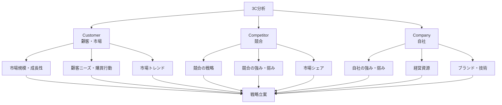
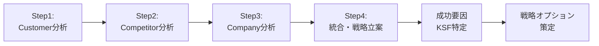

# 3C分析

## 導入問題

> あなたが新商品を市場に投入しようとしています。成功するためには何を知る必要があるでしょうか？
>
> 顧客のニーズだけを知っていれば十分でしょうか？それとも、他にも考慮すべき要素があるでしょうか？

## 考えるポイント

- 顧客が求めているものは何か？
- 競合他社はどのような戦略を取っているか？
- 自社にはどのような強みや資源があるか？
- これら3つの視点を統合することで、何が見えてくるか？

## 解説

### 用語定義

3C分析とは、マーケティング戦略を立案する際に、Customer（顧客・市場）、Competitor（競合）、Company（自社）の3つの視点から環境を分析するフレームワークです。大前研一氏が提唱した戦略立案の基本的なフレームワークで、ビジネスの成功要因を多角的に把握するための手法です。

### 背景・なぜ重要か

市場環境が複雑化する中で、顧客のニーズだけに注目していても成功は保証できません。競合の動向を無視すれば差別化ができず、自社の能力を超えた戦略を立てても実行できません。3C分析は、これら3つの要素を統合的に分析することで、実現可能かつ競争優位性のある戦略を導き出すための基盤となります。

## 詳細説明

3C分析は、以下の3つの視点から環境を分析します。

<!-- textlint-disable -->

<!-- textlint-enable -->

### 1. Customer（顧客・市場）

顧客および市場環境を分析します。

**分析すべきポイント**
- 市場規模と成長性
- 顧客セグメント（年齢、性別、所得層など）
- 顧客ニーズと購買動機
- 購買行動パターン
- 市場トレンドと変化の兆し

### 2. Competitor（競合）

競合企業の戦略や動向を分析します。

**分析すべきポイント**
- 主要競合企業の特定
- 競合の市場シェア
- 競合の製品・サービス戦略
- 競合の強み（技術力、ブランド力、販売網など）
- 競合の弱み（品質問題、コスト構造など）
- 競合の今後の戦略予測

### 3. Company（自社）

自社の内部環境を客観的に分析します。

**分析すべきポイント**
- 自社の経営資源（人材、資金、技術、設備）
- 自社の強み・コアコンピタンス
- 自社の弱み・課題
- ブランド力・認知度
- 既存の顧客基盤
- 組織体制と企業文化

## 3C分析の実施手順

<!-- textlint-disable -->

<!-- textlint-enable -->

1. **Customer分析**: 市場・顧客の実態を把握
2. **Competitor分析**: 競合の戦略と強み・弱みを把握
3. **Company分析**: 自社の能力と資源を客観的に評価
4. **統合**: 3つの分析結果を統合し、Key Success Factor（成功要因）を特定
5. **戦略立案**: KSFに基づいて、実行可能な戦略を策定

## 具体例・ケーススタディ

### 例1：スマートフォン市場への新規参入

**Customer（顧客・市場）**
- 市場規模：年間15億台、成長率5%
- 主要顧客層：20〜40代、価格帯3万〜10万円が主流
- ニーズ：カメラ性能、バッテリー持続時間、5G対応

**Competitor（競合）**
- Apple：プレミアム市場で40%シェア、ブランド力・エコシステムが強み
- Samsung：技術力・ディスプレイ品質が強み、全価格帯をカバー
- 中国メーカー：コストパフォーマンスが強み、急速に成長中

**Company（自社）**
- 強み：独自のAI技術、カメラセンサー技術
- 弱み：ブランド認知度が低い、販売チャネルが限定的
- 資源：研究開発に年間100億円投資可能

**戦略立案**
- KSF：差別化されたカメラ機能、コストパフォーマンス
- 戦略：AI技術を活かした高性能カメラをミドルレンジ価格で提供、オンライン販売を中心に展開

### 例2：地域密着型カフェチェーン

**Customer（顧客・市場）**
- ターゲット：30〜50代の地域住民、在宅ワーカー
- ニーズ：落ち着いた空間、安定した品質、地域コミュニティの場

**Competitor（競合）**
- 大手チェーン：全国展開、認知度高い、標準化されたサービス
- 個人経営カフェ：個性的、常連客に強い、柔軟な対応

**Company（自社）**
- 強み：地域ネットワーク、地元食材の調達ルート、経験豊富なバリスタ
- 弱み：資金力が限定的、店舗数が少ない

**戦略立案**
- KSF：地域密着性、コミュニティ形成
- 戦略：地元食材を使ったメニュー開発、地域イベントとの連携、常連客向けのコミュニティスペース提供

## SWOT分析との連携

3C分析で得られた情報は、SWOT分析の入力情報として活用できます。

- **Customer・Competitor分析** → 外部環境（Opportunities・Threats）
- **Company分析** → 内部環境（Strengths・Weaknesses）

この連携により、より精緻な戦略立案が可能になります。

## 関連概念

- SWOT分析：3C分析の結果を構造化し、戦略オプションを導出
- PEST分析：マクロ環境分析として3C分析の前段階で実施
- バリューチェーン分析：Company分析をさらに詳細化

## 参考文献

- 大前研一『企業参謀』（1975年）
- フィリップ・コトラー『マーケティング・マネジメント』
