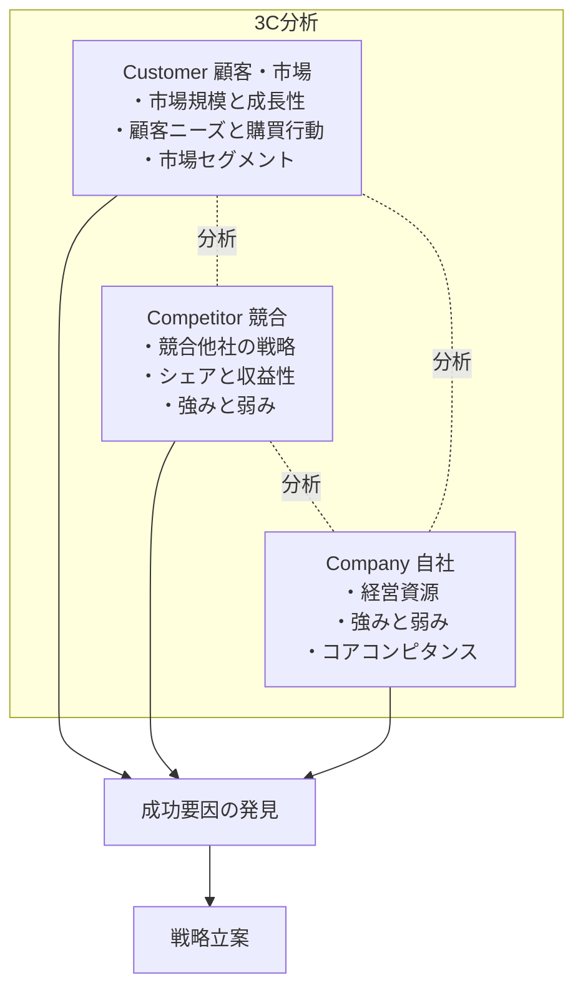
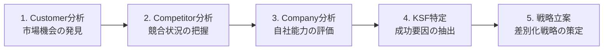
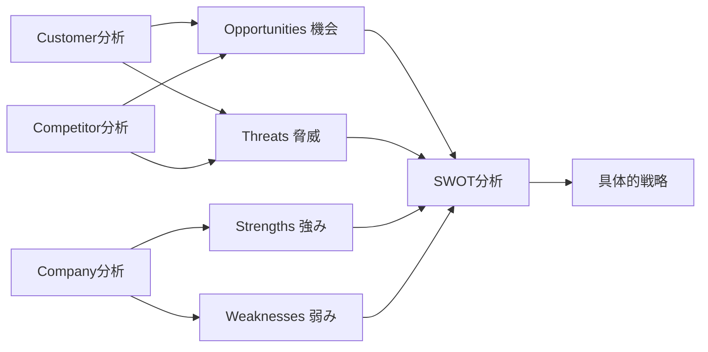

# 3C分析

## 導入問題

> あなたの会社が新製品を市場に投入しようとしています。成功させるために、何を調べ、何を考えるべきでしょうか？

## 考えるポイント

- お客様は何を求めているのか？どんなニーズがあるのか？
- ライバル企業はどんな戦略をとっているのか？
- 自社にはどんな強みがあり、何ができるのか？
- これらの情報をどう組み合わせて戦略を立てるべきか？

## 解説

### 用語定義

3C分析とは、Customer（顧客・市場）、Competitor（競合）、Company（自社）の3つの視点からビジネス環境を分析するマーケティングフレームワークです。この3つの「C」を総合的に分析することで、自社の戦略的ポジションを明確にします。

### 背景・なぜ重要か

1982年に経営コンサルタントの大前研一氏が提唱したフレームワークです。マーケティング戦略を立案する際、感覚や経験だけに頼るのではなく、客観的な環境分析が不可欠です。3C分析は、市場環境を体系的に理解し、成功要因（KSF: Key Success Factor）を見つけ出すための基本ツールとして、多くの企業で活用されています。

## 詳細説明

### 3つの視点

<!-- textlint-disable -->

<!-- textlint-enable -->

### 1. Customer（顧客・市場）分析

顧客と市場の実態を把握します。

**分析すべきポイント**

- **市場規模と成長性**: 市場全体の大きさ、成長率、将来予測
- **顧客ニーズ**: 顧客が求める価値、購買動機、未充足ニーズ
- **購買行動**: どこで、いつ、どのように購入するか
- **市場セグメント**: 顧客層の分類と各セグメントの特徴
- **市場トレンド**: 技術革新、社会変化、規制動向

### 2. Competitor（競合）分析

競合他社の状況を把握します。

**分析すべきポイント**

- **競合企業の特定**: 直接競合・間接競合・新規参入の可能性
- **マーケットシェア**: 各社のシェアと推移
- **競合の戦略**: 製品戦略、価格戦略、販売戦略、プロモーション戦略
- **強みと弱み**: 競合の得意分野と課題
- **業績**: 売上高、利益率、成長率
- **差別化要因**: 競合が顧客に提供している独自価値

### 3. Company（自社）分析

自社の実態を客観的に把握します。

**分析すべきポイント**

- **経営資源**: ヒト・モノ・カネ・情報の状況
- **強みと弱み**: 競合と比較した優位性や課題
- **コアコンピタンス**: 他社が真似できない独自の強み
- **ブランド力**: 市場での認知度とイメージ
- **技術力**: 研究開発能力、製造技術
- **販売チャネル**: 販売網の強さと効率性
- **組織能力**: 人材、企業文化、意思決定スピード

### 3C分析の実施手順

<!-- textlint-disable -->

<!-- textlint-enable -->

1. **Customer分析**: まず市場と顧客を理解し、機会を見つける
2. **Competitor分析**: 競合の動きを把握し、競争環境を理解する
3. **Company分析**: 自社の強み・弱みを客観的に評価する
4. **KSF（成功要因）の特定**: 3つの分析結果を統合し、市場で成功するための要因を抽出する
5. **戦略立案**: KSFに基づいて、具体的な戦略を策定する

## 具体例・ケーススタディ

### 例1：コンビニエンスストア業界の3C分析

**Customer（顧客・市場）**
- 市場規模：約11兆円（国内）、微増傾向
- 顧客ニーズ：利便性、24時間営業、品揃え、サービス多様化
- トレンド：高齢化社会、単身世帯増加、電子決済普及

**Competitor（競合）**
- セブン-イレブン：国内シェア約40%、商品開発力とPB商品の強さ
- ファミリーマート：店舗数で対抗、異業種連携
- ローソン：地域密着型、ヘルシー志向商品
- 新規競合：ドラッグストア、スーパーの小型店舗化

**Company（自社）**
- 既存チェーンの場合：店舗網、物流システム、商品開発力、ブランド認知度
- 新規参入の場合：差別化ポイントの明確化が必要

**導き出される戦略例**
- セブン-イレブン：商品品質で差別化、プライベートブランド強化
- ローソン：健康志向層をターゲット、病院・オフィス内出店
- ファミリーマート：エンタメ・デジタルとの融合

### 例2：カフェチェーンの3C分析

**Customer（顧客・市場）**
- 市場：働く世代、学生、リモートワーク需要の拡大
- ニーズ：作業スペース、Wi-Fi環境、居心地の良さ、コーヒー品質

**Competitor（競合）**
- スターバックス：高級志向、サードプレイス戦略、ブランド力
- ドトール：低価格帯、回転率重視
- コメダ珈琲：長居できる空間、フード充実

**Company（自社）**
例：新興カフェチェーン。
- 強み：地域密着、独自の内装デザイン、自家焙煎
- 弱み：ブランド認知度、出店資金

**導き出される戦略例**
- スターバックス：体験価値の提供、デジタル戦略強化
- 新興カフェ：ニッチ市場（ビジネスパーソン向けワークスペース特化など）での差別化

## SWOT分析との連携

3C分析で収集した情報は、SWOT分析の基礎データとなります。

<!-- textlint-disable -->

<!-- textlint-enable -->

- **Customer・Competitor分析** → SWOT分析の「機会」「脅威」（外部環境）
- **Company分析** → SWOT分析の「強み」「弱み」（内部環境）

3C分析で環境を理解し、SWOT分析でより具体的な戦略に落とし込むという流れが効果的です。

## 実施上の注意点

### 客観性を保つ

- 自社に都合の良い情報だけを集めない
- 数値データを重視し、主観を排除する
- 外部の視点（顧客インタビュー、市場調査など）を取り入れる

### 情報の鮮度

- 市場環境は常に変化するため、定期的に更新する
- 特にデジタル市場では変化が速い

### 深掘りする

- 表面的な分析で終わらせない
- 「なぜ？」を繰り返し、本質的な要因を探る

## 関連概念

- SWOT分析（3C分析の結果を戦略に落とし込む）
- PEST分析（マクロ環境分析）
- バリューチェーン分析（自社の価値創造プロセス分析）
- ファイブフォース分析（業界構造分析）

## 参考文献

- 大前研一『ストラテジック・マインド』（1982年）
- フィリップ・コトラー『マーケティングマネジメント』
