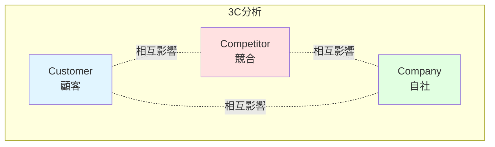
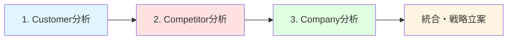

# 3C分析

## 導入問題

> 新商品を発売する前に、「まず何を調べるべきか」と聞かれたら、あなたは何を思い浮かべますか？
>
> 競合の動き？顧客のニーズ？それとも自社の強み？

## 考えるポイント

- マーケティング戦略を立てる際、どんな情報が必要でしょうか
- 市場で成功するためには、どんな視点から環境を分析すべきでしょうか
- 「見るべき対象」を絞り込むと、どんな要素が浮かび上がってくるでしょうか

## 解説

### 用語定義

**3C分析**とは、マーケティング環境を分析するための基本フレームワークです。
Customer（顧客）、Competitor（競合）、Company（自社）の3つの「C」から市場を多角的に分析し、戦略立案の基盤とします。

### 背景・なぜ重要か

ビジネス環境は複雑で、多くの要素が絡み合っています。
しかし、すべてを同時に考えると混乱してしまいます。
3C分析は「顧客」「競合」「自社」という3つの視点に絞ることで、マーケティング環境を体系的かつ効率的に整理できます。

この分析は、以下のような場面で威力を発揮します。

- 新規事業の立ち上げ
- 既存商品のリニューアル
- 市場参入前の環境調査
- SWOT分析の前準備

## 詳細説明

### 3つのCとは

<!-- textlint-disable -->

<!-- textlint-enable -->

### 1. Customer（顧客）

**分析すべきポイント**

- 顧客の属性（年齢、性別、職業、所得など）
- 購買行動（いつ、どこで、どのように購入するか）
- ニーズと課題（何を求めているか、何に困っているか）
- 市場規模と成長性（市場はどれくらいの規模で、今後どう変化するか）

**問いかけ例**

- 「誰がターゲットか？」
- 「顧客は何に価値を感じるのか？」
- 「市場はどの方向に動いているか？」

### 2. Competitor（競合）

**分析すべきポイント**

- 競合企業の特定（直接競合、間接競合は誰か）
- 競合の強みと弱み（製品、価格、販路、ブランド力など）
- 競合のシェアと戦略（どんな手を打っているか）
- 市場での位置づけ（リーダー、チャレンジャー、ニッチャーなど）

**問いかけ例**

- 「競合はどこか？」
- 「競合は何を武器にしているか？」
- 「競合と比べた際の差別化ポイントはどこか？」

### 3. Company（自社）

**分析すべきポイント**

- 自社の経営資源（ヒト、モノ、カネ、情報、技術）
- 自社の強みと弱み（製品力、技術力、販売力、ブランド力など）
- 自社のビジョンと戦略（目指す方向性は何か）
- 現在の市場ポジション（どこにいて、どこを目指すか）

**問いかけ例**

- 「自社は何ができるのか？」
- 「自社の強みをどう活かすか？」
- 「自社の弱みをどう補うか？」

### 3C分析の実施手順

<!-- textlint-disable -->

<!-- textlint-enable -->

1. **Customer（顧客）から始める**: 市場と顧客のニーズを理解する
2. **Competitor（競合）を調べる**: 競合がどう動いているかを把握する
3. **Company（自社）を見つめる**: 自社の強み・弱みを客観的に評価する
4. **統合して戦略を立てる**: 3つの視点を組み合わせて勝ち筋を見つける

### SWOT分析との連携

3C分析で集めた情報は、SWOT分析の材料になります。

- **Customer分析** → Opportunity（機会）、Threat（脅威）の発見
- **Competitor分析** → Threat（脅威）の特定、差別化ポイントの発見
- **Company分析** → Strength（強み）、Weakness（弱み）の明確化

この流れで分析すると、より実効性の高い戦略を導けます。

## 具体例・ケーススタディ

### 例1：カフェチェーンの新店舗出店

あるカフェチェーンが新しいエリアに出店を検討しているケースです。

**Customer（顧客）**

- ターゲット：20〜30代のビジネスパーソン、学生
- ニーズ：Wi-Fi完備の作業スペース、手頃な価格、落ち着いた雰囲気
- 市場規模：周辺にオフィスビルと大学があり、平日昼間の需要が見込める

**Competitor（競合）**

- 大手カフェチェーンA：駅前に店舗あり、ブランド力強い、価格は高め
- 個人経営カフェB：隠れ家的な雰囲気、席数少ない、Wi-Fi不安定
- コンビニC：価格は安いが、滞在スペースは限定的

**Company（自社）**

- 強み：Wi-Fi環境、座席数の多さ、中価格帯の品揃え
- 弱み：ブランド認知度が大手に劣る
- 戦略：「作業しやすいカフェ」として差別化

**結論**

顧客の「作業スペース」ニーズに対し、競合が十分に応えていない。
自社の強み（Wi-Fi、座席数）を活かし、「長時間滞在型カフェ」として出店する価値がある。

### 例2：家電メーカーの新製品開発

家電メーカーが次世代掃除機を開発するケースです。

**Customer（顧客）**

- ターゲット：共働き世帯、30〜40代
- ニーズ：掃除の時短、静音性、ペットの毛対策
- 市場動向：ロボット掃除機の普及率が上昇中

**Competitor（競合）**

- 外資系メーカーD：高価格帯、高性能、ブランド力あり
- 国内メーカーE：中価格帯、バランス型、シェア高い
- 新興メーカーF：低価格、性能は限定的

**Company（自社）**

- 強み：国内製造、きめ細かいサポート、技術力
- 弱み：価格競争力、デザイン性
- 戦略：「日本の住環境に最適化」をコンセプトに

**結論**

顧客の「静音性」「ペット対応」ニーズに注目。
競合が海外仕様中心なのに対し、自社は日本の住宅事情（狭い、畳あり）に特化した製品で差別化を図る。

## 関連概念

- [SWOT分析](../../カネ/経営戦略/SWOT分析.md) - 3C分析の情報を使って強み・弱み・機会・脅威を整理
- [PEST分析](./PEST分析.md) - マクロ環境（政治・経済・社会・技術）を分析するフレームワーク
- [ファイブフォース分析](./ファイブフォース分析.md) - 業界の競争構造を5つの要因から分析

## 参考文献

- 大前研一『ストラテジック・マインド』（1982年）
- フィリップ・コトラー『コトラーのマーケティング・マネジメント』
- グロービス経営大学院『グロービスMBAマーケティング』
