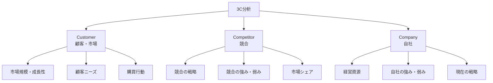
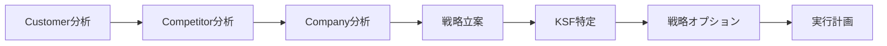

# 3C分析

## 導入問題

> あなたの会社が新商品を投入しようとしています。市場で成功するために、何を調べればよいでしょうか？
>
> お客様のニーズだけでしょうか？それとも競合の動きも見るべきでしょうか？自社の強みは関係ないのでしょうか？

## 考えるポイント

- ビジネスは独立して存在するのではなく、市場の中で様々なプレイヤーと関わっている
- 成功のためには、外部環境と内部環境の両方を理解する必要がある
- 顧客、競合、自社という3つの視点から考えることで、全体像が見えてくる

## 解説

### 用語定義

3C分析とは、マーケティング戦略を立案する際の基本的な環境分析フレームワークです。Customer（顧客・市場）、Competitor（競合）、Company（自社）の3つの視点から分析することで、ビジネスの成功要因を明確にします。

### 背景・なぜ重要か

1980年代に大前研一氏によって提唱されたこのフレームワークは、戦略立案の出発点として広く使われています。ビジネスの成功は、顧客ニーズを理解し、競合との差別化を図り、自社の強みを活かすことで実現します。この3つの要素を漏れなく分析することで、戦略の方向性を見出すことができます。

## 詳細説明

### 3Cの構成要素

<!-- textlint-disable -->

<!-- textlint-enable -->

### 1. Customer（顧客・市場）

顧客・市場の分析では、以下のポイントを押さえます。

**市場環境**
- 市場規模と成長率
- 市場のセグメント（年齢、地域、用途など）
- 市場のトレンドや変化の兆し

**顧客ニーズ**
- 顕在ニーズと潜在ニーズ
- 購買決定要因（価格、品質、ブランド、利便性など）
- 満たされていないニーズ（市場機会）

**購買行動**
- 購買プロセス（認知→検討→購入→利用）
- 購買チャネル（店舗、EC、直販など）
- 購買頻度と単価

### 2. Competitor（競合）

競合分析では、直接競合だけでなく、間接競合や代替品も視野に入れます。

**競合の特定**
- 直接競合（同じ商品・サービスを提供）
- 間接競合（異なる方法で同じニーズを満たす）
- 新規参入の可能性

**競合の戦略**
- 商品・サービスの特徴
- 価格戦略
- 販売チャネル
- プロモーション方法

**競合の評価**
- 市場シェア
- 強み（差別化要因、ブランド力、技術力など）
- 弱み（課題、脆弱性）
- 最近の動向（新商品、提携、M&Aなど）

### 3. Company（自社）

自社分析では、客観的に自社の現状を把握します。

**経営資源**
- ヒト（人材、組織能力）
- モノ（設備、技術、特許）
- カネ（資金力、収益性）
- 情報（顧客データ、ノウハウ）

**自社の強みと弱み**
- 競合と比較した優位性
- コア・コンピタンス（独自の強み）
- 改善すべき弱点

**現在の戦略と成果**
- 現在の事業戦略
- 売上・利益の推移
- 市場シェアとポジション

### 3C分析の実施手順

<!-- textlint-disable -->

<!-- textlint-enable -->

1. **Customer分析から始める**: 市場と顧客を理解することが出発点
2. **Competitor分析で競合を知る**: 競合の動きと自社のポジションを把握
3. **Company分析で自社を見つめる**: 自社の強みと弱みを客観的に評価
4. **KSF（Key Success Factor）を特定**: 3つの分析から成功の鍵となる要因を導く
5. **戦略を立案**: KSFに基づいて具体的な戦略を策定

## 具体例・ケーススタディ

### 例1：カフェチェーンの新規出店戦略

**Customer（顧客・市場）**
- 市場：オフィス街で働く20-40代のビジネスパーソン
- ニーズ：朝の通勤時のコーヒー、昼休みの軽食、仕事の合間のリフレッシュ
- 購買行動：立地とスピードを重視、価格は500円以下が中心

**Competitor（競合）**
- 大手チェーンA：全国展開、ブランド力が強い、価格は高め
- 個人カフェB：こだわりのコーヒー、居心地重視、回転率は低い
- コンビニC：低価格、利便性が高い、品質はそこそこ

**Company（自社）**
- 強み：独自の焙煎技術、ITシステムによる効率的オペレーション
- 弱み：ブランド認知度が低い、店舗数が少ない
- 資源：出店資金は潤沢、ITエンジニアが多い

**導き出された戦略**
- KSF：「高品質」×「スピード」×「適正価格」の両立
- 戦略：モバイルオーダーで待ち時間ゼロ、大手より100円安く高品質なコーヒーを提供
- 差別化：アプリでの事前注文と決済により、レジ待ちを解消

### 例2：SaaS企業の市場参入

**Customer（顧客・市場）**
- 市場：中小企業の経理業務（市場成長率15%）
- ニーズ：経理業務の効率化、コスト削減、クラウド化
- 購買決定要因：使いやすさ、価格、サポート体制

**Competitor（競合）**
- 既存大手：機能は豊富だが価格が高い、操作が複雑
- 新興ベンチャー：シンプルで使いやすいが、機能が限定的
- Excel：コストゼロだが、業務効率は悪く、ミスが多い

**Company（自社）**
- 強み：UI/UX設計の専門チーム、カスタマーサクセスのノウハウ
- 弱み：機能開発リソースが限られている、知名度がない
- 資源：創業メンバーが経理出身、中小企業との人脈がある

**導き出された戦略**
- KSF：「中小企業に特化」×「使いやすさ」×「手厚いサポート」
- 戦略：月額9,800円の低価格、必要最小限の機能に絞り、導入支援を無料提供
- 差別化：経理担当者向けのオンボーディングプログラムと電話サポート

## 関連概念

- SWOT分析：3C分析の結果を踏まえ、機会と脅威、強みと弱みを整理するフレームワーク
- PEST分析：マクロ環境（政治、経済、社会、技術）を分析し、市場環境をより広く理解
- ファイブフォース分析：業界構造を分析し、競合の範囲を広げて考える
- バリュープロポジション：顧客ニーズと自社の強みを結びつけ、独自の価値提案を作る

## 参考文献

- 大前研一『ストラテジック・マインド』（1982年）
- Philip Kotler『マーケティング・マネジメント』
- Michael Porter『競争の戦略』（1980年）
