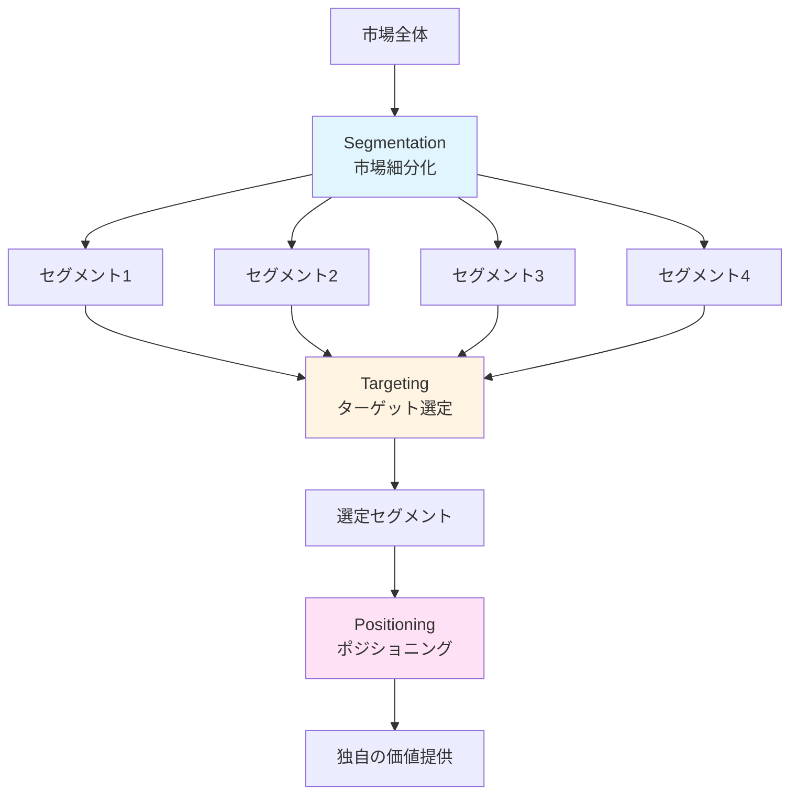

# STP分析

## 導入問題

> スターバックスと缶コーヒーは、どちらも「コーヒー」を売っていますが、なぜ価格もブランドイメージもまったく違うのでしょうか？
>
> 同じコーヒー市場にいるのに、なぜこれほど差別化できているのでしょうか？

## 考えるポイント

- それぞれの商品は、どのような人をターゲットにしているか
- 顧客にとって「コーヒー」の価値は何か（味、時間、空間など）
- 競合他社との違いをどう打ち出しているか
- 市場全体をどのように分けて考えているか

## 解説

### 用語定義

STP分析とは、マーケティング戦略を構築する際の基本フレームワークで、以下の3つのステップから構成されます。

- **Segmentation（市場細分化）**: 市場を意味のあるグループに分ける
- **Targeting（ターゲット選定）**: どのグループを狙うか決める
- **Positioning（ポジショニング）**: 競合との違いを明確にする

この3つのステップを順番に実行することで、効果的なマーケティング戦略を策定できます。

### 背景・なぜ重要か

現代の市場は多様化が進み、すべての顧客に同じ商品・サービスを提供しても成功しません。
顧客のニーズは年齢、ライフスタイル、価値観などによって大きく異なります。

STP分析によって、限られた経営資源を最も効果的なターゲットに集中投下し、競合と差別化された独自のポジションを確立できます。
「誰に」「何を」「どのように」届けるかを明確にすることが、マーケティング成功の鍵です。

## 詳細説明

### Segmentation（市場細分化）

市場を細分化する際の主な変数は以下の通りです。

**地理的変数**
- 国、地域、都市規模、気候など

**デモグラフィック変数**
- 年齢、性別、家族構成、職業、所得、学歴など

**心理的変数**
- ライフスタイル、価値観、パーソナリティなど

**行動変数**
- 購買頻度、使用状況、ブランドロイヤルティ、求めるベネフィットなど

### Targeting（ターゲット選定）

細分化した市場セグメントを評価し、どこを狙うかを決定します。
評価基準は以下の通りです。

**市場規模と成長性**
- セグメントは十分な規模があるか
- 今後も成長が見込めるか

**競争環境**
- 競合他社の状況はどうか
- 参入障壁はあるか

**自社適合性**
- 自社の強みを活かせるか
- 経営資源は十分か

### Positioning（ポジショニング）

選定したターゲットに対して、競合と差別化された独自の価値を提供します。
ポジショニングの考え方は以下の通りです。

**差別化軸の設定**
- 価格、品質、デザイン、利便性など
- 顧客にとって重要な軸を選ぶ

**競合との比較**
- 競合はどのポジションにいるか
- 空白地帯はあるか

**一貫性の維持**
- 製品、価格、流通、プロモーションすべてでポジションを強化

### STP分析の流れ

<!-- textlint-disable -->

<!-- textlint-enable -->

## 具体例・ケーススタディ

### 例1：スターバックスのSTP分析

**Segmentation（市場細分化）**
- コーヒー市場を「価格重視層」「品質重視層」「空間重視層」などに細分化

**Targeting（ターゲット選定）**
- 都市部に住む20〜40代の「空間と体験を重視する層」をターゲット
- 所得水準が比較的高く、カフェでの時間に価値を見出す顧客

**Positioning（ポジショニング）**
- 「第三の場所（サードプレイス）」として位置づけ
- 家と職場のどちらでもない、くつろげる空間を提供
- プレミアムコーヒーと快適な空間で差別化

### 例2：ユニクロのSTP分析

**Segmentation（市場細分化）**
- アパレル市場を「ファッション性重視」「機能性重視」「価格重視」などに細分化

**Targeting（ターゲット選定）**
- 幅広い年齢層の「シンプルで高品質な服を求める層」
- 年齢・性別を問わず「ベーシックな服を手頃な価格で」というニーズ

**Positioning（ポジショニング）**
- 「高品質×低価格×ベーシックデザイン」で位置づけ
- ファストファッションでありながら品質を追求
- LifeWear（日常着）というコンセプトで差別化

### 例3：レッドブルのSTP分析

**Segmentation（市場細分化）**
- 飲料市場を「エネルギー補給」「リフレッシュ」「健康志向」などに細分化

**Targeting（ターゲット選定）**
- 10〜30代の「アクティブでエネルギッシュなライフスタイルを送る層」
- スポーツやイベントに積極的な若者層

**Positioning（ポジショニング）**
- 「翼を授ける」というコンセプトで位置づけ
- エナジードリンクというカテゴリーそのものを創出
- エクストリームスポーツのスポンサーシップで差別化

## 関連概念

- [4P分析](./4P分析.md) - STP分析で決めた戦略を具体的な施策に落とし込む
- [SWOT分析](../経営戦略/SWOT分析.md) - 自社の強み・弱みを分析してターゲット選定に活かす
- [バリュープロポジション](./バリュープロポジション.md) - ポジショニングを具体化する顧客価値の提案

## 参考文献

- フィリップ・コトラー『マーケティングマネジメント』（ピアソン・エデュケーション）
- アル・ライズ、ジャック・トラウト『ポジショニング戦略』（海と月社）
