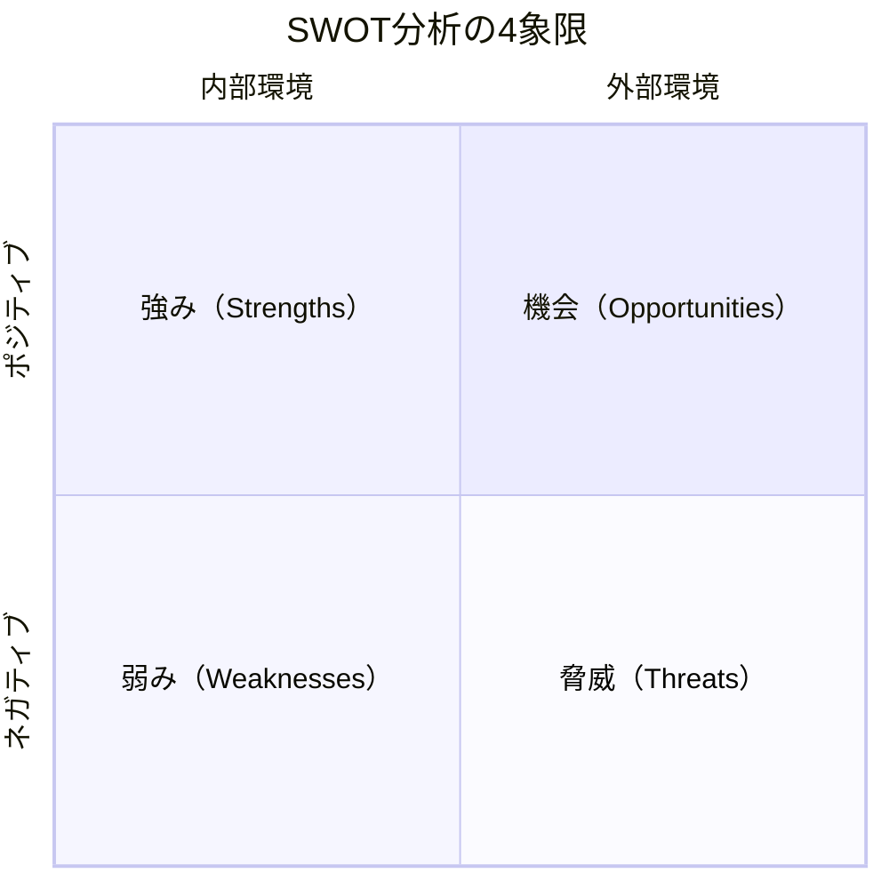
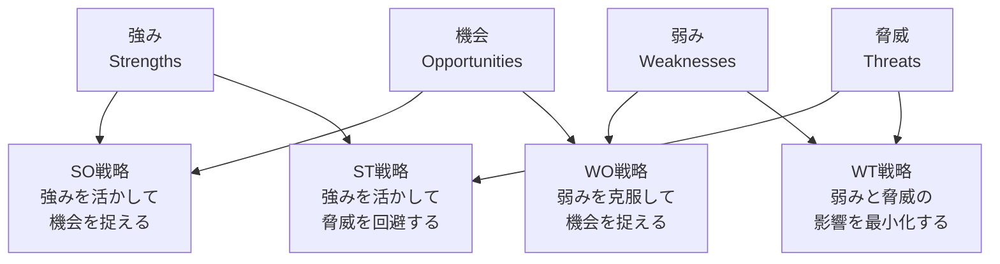

# SWOT分析

## 導入問題

> あなたの会社が新製品の発売を検討しています。
> 競合が増え、技術も進化している市場で、どのような戦略を立てればよいでしょうか？
>
> 何から分析を始めますか？

## 考えるポイント

- 自社の強みと弱みを理解しているか
- 市場の機会と脅威を把握しているか
- 内部環境と外部環境を分けて考えているか
- それらを組み合わせて戦略を立てられるか

## 解説

### 用語定義

SWOT分析とは、企業や事業の戦略を策定する際に使われる基本的なフレームワークです。
内部環境の「Strengths（強み）」「Weaknesses（弱み）」と、外部環境の「Opportunities（機会）」「Threats（脅威）」の4つの要素を分析します。

### 背景・なぜ重要か

1960年代にスタンフォード大学のアルバート・ハンフリーらによって開発されました。
経営戦略を立てる際、自社の内部リソースと外部環境を体系的に整理できるため、世界中のビジネスシーンで広く活用されています。
戦略の方向性を決める出発点として、今なお有効なフレームワークです。

## 詳細説明

### 4つの要素

<!-- textlint-disable -->

<!-- textlint-enable -->

#### Strengths（強み）- 内部環境のプラス要因

- 自社が持つ競争優位性
- 例：高い技術力、強いブランド、優秀な人材、豊富な資金

#### Weaknesses（弱み）- 内部環境のマイナス要因

- 自社が抱える課題や不足
- 例：技術の遅れ、ブランド力不足、人材不足、資金制約

#### Opportunities（機会）- 外部環境のプラス要因

- 市場や社会の変化から生まれるチャンス
- 例：新技術の登場、規制緩和、市場の成長、ニーズの変化

#### Threats（脅威）- 外部環境のマイナス要因

- 自社に不利に働く外部要因
- 例：競合の台頭、規制強化、市場の縮小、技術の陳腐化

### クロスSWOT分析

4つの要素を掛け合わせることで、具体的な戦略を導き出せます。

<!-- textlint-disable -->

<!-- textlint-enable -->

- **SO戦略（積極戦略）**：強みを活かして機会を最大限に活用
- **ST戦略（差別化戦略）**：強みを活かして脅威を回避・軽減
- **WO戦略（改善戦略）**：弱みを克服して機会を捉える
- **WT戦略（防衛・撤退戦略）**：弱みと脅威の影響を最小化

## 具体例・ケーススタディ

### 例1：カフェチェーンの新規出店

**Strengths（強み）**
- オリジナルブレンドのコーヒー豆
- スタッフの接客スキルが高い
- SNSでのブランド認知度が高い

**Weaknesses（弱み）**
- 店舗数が競合より少ない
- 価格帯が競合より高め
- 郊外への出店ノウハウ不足

**Opportunities（機会）**
- 在宅勤務増加でカフェ需要拡大
- サードプレイス需要の高まり
- 地方都市の再開発計画

**Threats（脅威）**
- 大手チェーンの低価格戦略
- コンビニコーヒーの品質向上
- 原材料費の高騰

**導き出される戦略**
- **SO戦略**：高品質なコーヒーとSNS発信力を活かし、在宅ワーカー向け「静かなサードプレイス」として展開
- **ST戦略**：高い接客スキルとブランド力で差別化し、低価格競争を回避
- **WO戦略**：再開発地域に小型店舗で出店し、郊外ノウハウを蓄積
- **WT戦略**：原材料費高騰に対し、店舗効率化と高付加価値メニュー開発で対応

### 例2：製造業の海外展開

**クロスSWOT分析の例**
- **SO戦略**：高い技術力を活かして、成長する新興国市場に進出
- **ST戦略**：品質の高さで差別化し、現地競合との価格競争を回避
- **WO戦略**：現地企業と提携して販路を拡大し、知名度不足を克服
- **WT戦略**：為替リスクに備え、現地生産比率を高める

## 分析時の注意点

### よくある失敗

1. **事実と願望の混同**
   - 「強み」に願望を書かない
   - 客観的なデータや顧客の声に基づく

2. **内部と外部の混同**
   - 強み・弱みは自社がコントロールできる内部要因
   - 機会・脅威は自社がコントロールできない外部要因

3. **抽象的すぎる分析**
   - 「技術力がある」ではなく「特定分野で特許を10件保有」
   - 具体的に記述することで戦略が立てやすくなる

4. **分析だけで終わる**
   - SWOT分析は戦略立案の出発点
   - クロスSWOT分析で具体的なアクションに落とし込む

### 効果的な分析のコツ

- 複数人でブレインストーミングを行う
- 外部の視点（顧客、取引先）を取り入れる
- 定期的に見直し、環境変化に対応する
- 優先順位をつけて重要な要素に絞る

## 関連概念

- [ファイブフォース分析](./ファイブフォース分析.md)（外部環境分析のフレームワーク）
- [バリューチェーン分析](./バリューチェーン分析.md)（内部環境分析のフレームワーク）
- [PEST分析](./PEST分析.md)（マクロ環境分析のフレームワーク）

## 参考文献

- マイケル・E・ポーター『競争の戦略』（ダイヤモンド社、1982年）
- 『グロービスMBAマネジメント・ブック［改訂3版］』（ダイヤモンド社、2008年）
