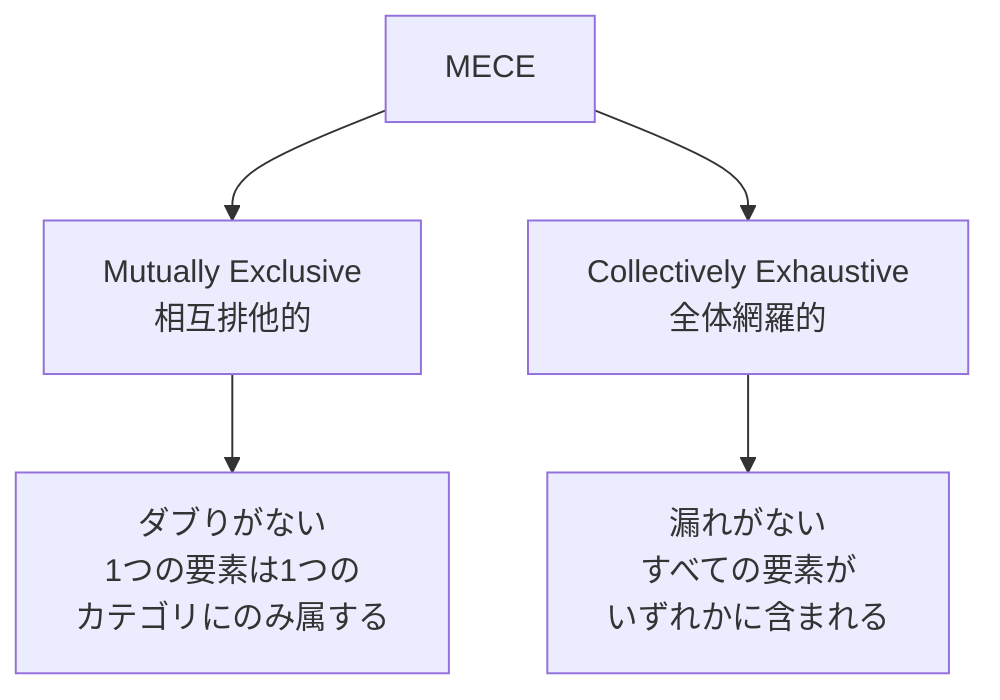
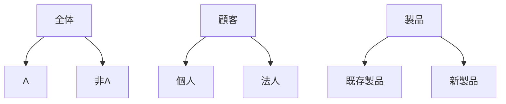
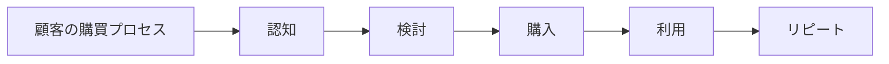
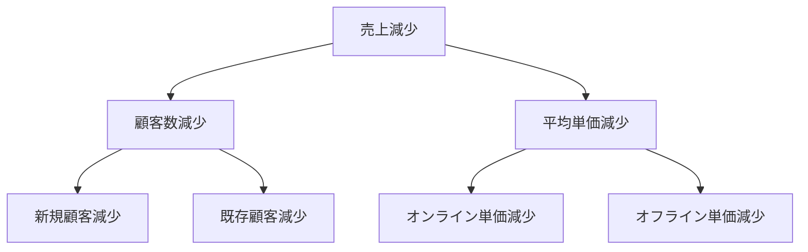
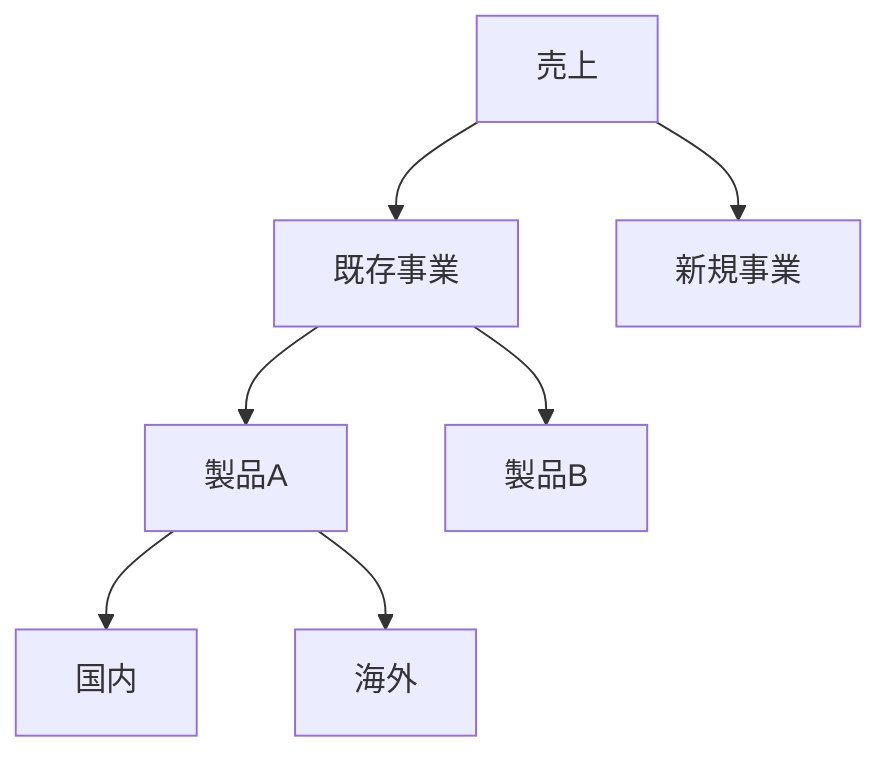

# MECE

## 導入問題

> 会議で「顧客を分類して分析しよう」という話になりました。
> あるメンバーは「個人と法人に分けましょう」と提案し、別のメンバーは「新規顧客とリピーターに分けましょう」と提案しました。
> どちらの分類方法が適切でしょうか？それとも両方とも問題があるのでしょうか？

## 考えるポイント

- 分類で漏れはないか？すべての顧客が必ずどこかに含まれるか？
- 分類で重複はないか？1つの顧客が複数のカテゴリに該当することはないか？
- 分析の目的と合致した分類になっているか？

## 解説

### 用語定義

MECE（ミーシー）は、**Mutually Exclusive, Collectively Exhaustive**の略語で、「相互排他的かつ全体網羅的」という意味です。日本語では「漏れなく、ダブりなく」と表現されます。

ロジカルシンキングの基本原則であり、問題分析、分類、提案などあらゆる思考の場面で活用されます。

### 背景・なぜ重要か

ビジネスの意思決定では、限られた時間で正確な判断を下す必要があります。
しかし、分類や分析に「漏れ」や「ダブり」があると、以下の問題が発生します。

- **漏れがある場合**: 重要な視点を見落とし、誤った結論に至る
- **ダブりがある場合**: 同じものを二重にカウントし、数値が不正確になる

MECEを意識することで、網羅的かつ効率的な思考ができます。

## 詳細説明

MECEの2つの要素を詳しく見ていきましょう。

<!-- textlint-disable -->

<!-- textlint-enable -->

### 1. Mutually Exclusive（相互排他的）

各カテゴリが重複しない状態です。
1つの要素は必ず1つのカテゴリにのみ属します。

**良い例**：顧客を「新規・既存」で分類。
- 新規顧客：初めて取引する顧客
- 既存顧客：過去に取引がある顧客
→ 1人の顧客は必ずどちらか一方に属する。

**悪い例**：顧客を「大口・法人」で分類。
- 大口顧客と法人顧客は重複する可能性がある
- 大口の法人顧客は両方に該当してしまう

### 2. Collectively Exhaustive（全体網羅的）

すべての要素がいずれかのカテゴリに含まれる状態です。
抜け漏れがありません。

**良い例**：年齢を「0-19歳、20-39歳、40-59歳、60歳以上」で分類。
- すべての人が必ずどこかに含まれる

**悪い例**：年齢を「20代、30代、40代」で分類。
- 10代、50代以上が含まれない

## MECEな分類の作り方

### パターン1：二項対立

全体を2つに分ける方法です。シンプルで使いやすいパターンです。

<!-- textlint-disable -->

<!-- textlint-enable -->

### パターン2：プロセス分解

時系列や手順に沿って分類します。

<!-- textlint-disable -->

<!-- textlint-enable -->

### パターン3：既存のフレームワーク活用

確立されたフレームワークを使用すると、MECEが保証されます。

- **3C分析**: 顧客（Customer）・競合（Competitor）・自社（Company）
- **4P**: 製品（Product）・価格（Price）・流通（Place）・プロモーション（Promotion）
- **SWOT分析**: 強み・弱み・機会・脅威

## 具体例・ケーススタディ

### 例1：売上分析

**状況**: 前年比で売上が減少した原因を分析したい。

**MECEでない分析**：
- オンライン販売が減少した。
- 新規顧客が減少した。

→ これでは漏れがある。既存顧客やオフライン販売はどうなのか？

**MECEな分析**：
売上 = 顧客数 × 平均単価。

さらに分解すると、次のようになります。
- 顧客数 = 新規顧客 + 既存顧客
- チャネル = オンライン + オフライン

<!-- textlint-disable -->

<!-- textlint-enable -->

この分解により、すべての要因を漏れなく検討できます。

### 例2：業務改善提案

**状況**: 営業部門の生産性を向上させたい。

**MECEでない提案**：
- 訪問件数を増やす。
- 提案書の質を上げる。

→ 他に重要な要素が抜けている可能性がある。

**MECEな提案**：
営業活動を「準備」「実行」「フォロー」のプロセスで分類します。

1. **準備段階**: リスト作成、情報収集、アポイント取得
2. **実行段階**: 訪問、ヒアリング、提案
3. **フォロー段階**: 見積提出、交渉、契約締結

各段階で改善策を検討することで、漏れのない提案ができます。

## MECEを使う際の注意点

### 1. 目的に応じた切り口を選ぶ

同じ対象でも、分析目的によって適切な分類は変わります。

**顧客分類の例**：
- マーケティング施策を考えるなら → 新規/既存
- 売上目標を設定するなら → 大口/中口/小口
- サービス品質を改善するなら → 満足/不満

### 2. 完璧を求めすぎない

MECEは思考の道具です。
実務では「おおむねMECE」で十分な場合も多くあります。
時間をかけすぎて分析麻痺に陥らないよう注意しましょう。

### 3. 階層を意識する

複雑な問題は、何段階かに分けて分解します。

<!-- textlint-disable -->

<!-- textlint-enable -->

各階層でMECEを保つことで、全体として網羅的な分析になります。

## 関連概念

- [ロジックツリー](../クリティカルシンキング/ロジックツリー.md) - MECEを活用した問題の構造化
- [仮説思考](../クリティカルシンキング/仮説思考.md) - MECEによる網羅と優先順位付け

## 参考文献

- 『ロジカル・シンキング』（照屋華子、岡田恵子著、東洋経済、2001年）
- 『考える技術・書く技術』（バーバラ・ミント、ダイヤモンド社、1999年）
