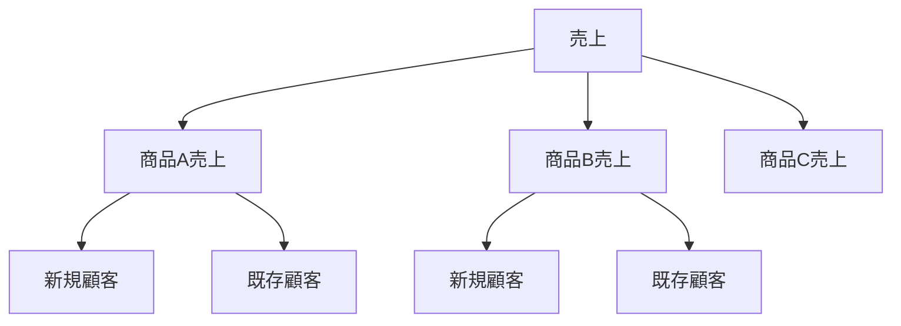
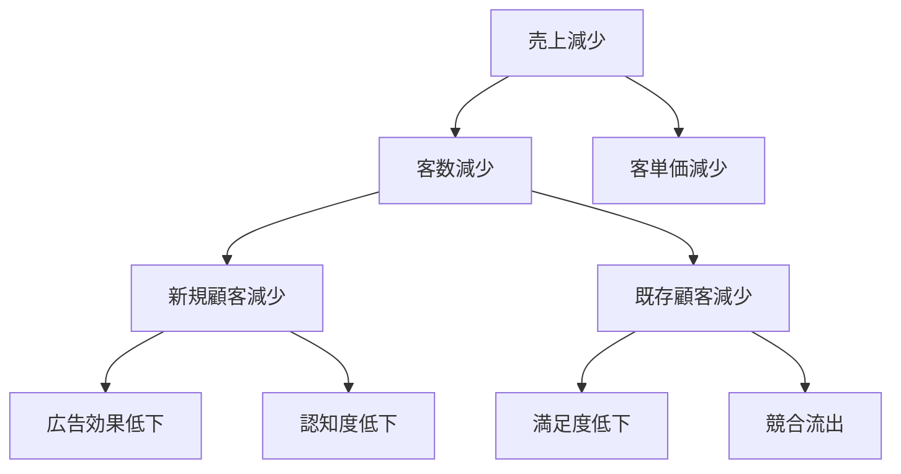
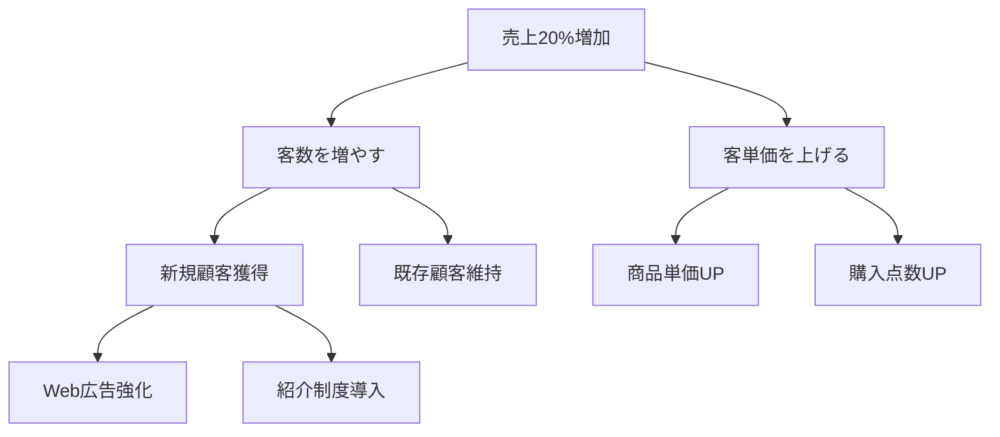
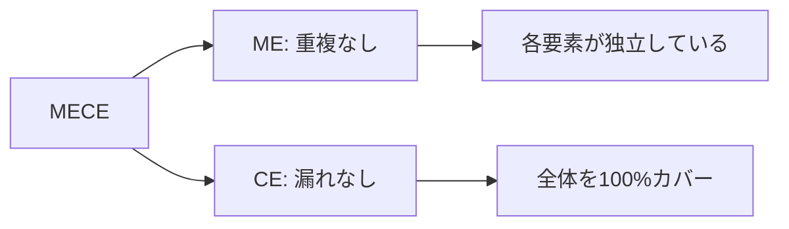
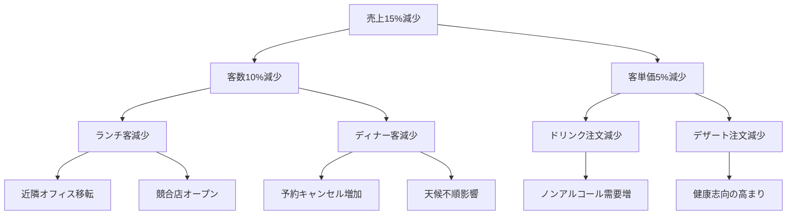
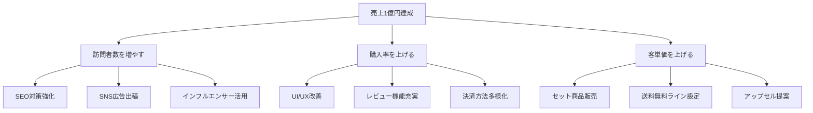
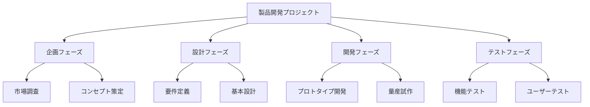

# ロジックツリー

## 導入問題

> 「売上が前年比で10%減少した」という問題に直面したとき、あなたはどのように原因を探りますか？
>
> また、「売上を20%増やす」という目標を掲げたとき、どのような方法で実現できるでしょうか？

## 考えるポイント

- 問題の原因は1つだけか、それとも複数の要因が絡み合っているか
- 目標を達成する方法は何通りあるか
- それぞれの要因や方法を、どのように整理すれば見落としがないか
- 大きな問題を小さく分解していくと、何が見えてくるか

## 解説

### 用語定義

**ロジックツリー**とは、問題や課題をツリー状に分解し、論理的に整理するためのフレームワークです。
大きな問題を小さな要素に分けていくことで、原因の特定や解決策の立案を体系的に行えます。

### 背景・なぜ重要か

ビジネスの現場では、複雑な問題に直面することが日常的にあります。
売上減少、顧客満足度の低下、業務効率の悪化など、これらの問題には多くの要因が絡み合っています。

ロジックツリーを使うことで、以下のメリットが得られます。

- **見落としの防止**: 体系的に分解することで、重要な要因を見落とさない
- **優先順位の明確化**: どの要素が最も重要かを判断しやすくなる
- **チーム内の共通理解**: 視覚化により、メンバー間で問題構造を共有できる
- **効率的な問題解決**: 本質的な原因や有効な解決策に素早くたどり着ける

## 詳細説明

### ロジックツリーの種類

ロジックツリーには、目的に応じて3つの主要な種類があります。

#### 1. Whatツリー（要素分解ツリー）

問題や対象を構成要素に分解するツリーです。
「何があるか」を明らかにします。

<!-- textlint-disable -->

<!-- textlint-enable -->

#### 2. Whyツリー（原因分析ツリー）

問題の原因を深掘りするツリーです。
「なぜそうなったか」を明らかにします。

<!-- textlint-disable -->

<!-- textlint-enable -->

#### 3. Howツリー（方法展開ツリー）

目標達成のための手段を展開するツリーです。
「どうやって実現するか」を明らかにします。

<!-- textlint-disable -->

<!-- textlint-enable -->

### MECEとの関係

ロジックツリーを作成する際の重要な原則が**MECE**（ミーシー）です。

MECEとは「Mutually Exclusive, Collectively Exhaustive」の略で、以下を意味します。

- **Mutually Exclusive（相互排他的）**: それぞれの要素が重複していない
- **Collectively Exhaustive（全体網羅的）**: 全体を漏れなくカバーしている

<!-- textlint-disable -->

<!-- textlint-enable -->

MECEを意識することで、論理的な抜け漏れのないツリーを作成できます。

### ロジックツリーの作成手順

#### ステップ1: 目的を明確にする

まず、何のためにツリーを作るのかを明確にします。

- 原因分析なら → Whyツリー
- 要素分解なら → Whatツリー
- 解決策立案なら → Howツリー

#### ステップ2: 第1階層を分解する

最上位の問題や目標を、MECEに分解します。
一般的な分解の切り口として以下があります。

- **時間軸**: 過去・現在・未来
- **プロセス**: 計画・実行・評価
- **売上**: 客数×客単価
- **利益**: 売上−コスト
- **顧客**: 新規・既存

#### ステップ3: 第2階層以降を展開する

各要素をさらに分解していきます。
3〜5階層程度まで深掘りすることが多いです。

分解を進める際のポイントは以下の通りです。

- 各階層でMECEを保つ
- 分解の切り口を統一する
- 実行可能なレベルまで具体化する

#### ステップ4: 検証と修正

作成したツリーを見直します。

- 重複や漏れはないか（MECE確認）
- 論理的なつながりは正しいか
- 実務で使える粒度まで分解できているか

## 具体例・ケーススタディ

### 例1: レストランの売上減少分析（Whyツリー）

あるレストランの売上が前年比15%減少した問題を分析します。

<!-- textlint-disable -->

<!-- textlint-enable -->

この分析により、主要因は「近隣オフィス移転」と「競合店オープン」であることが判明しました。
対策として、ディナー客向けの新メニュー開発とノンアルコールドリンクの充実を実施することになりました。

### 例2: 新規事業の売上目標達成（Howツリー）

新規ECサイトで「初年度売上1億円」という目標を達成する方法を検討します。

<!-- textlint-disable -->

<!-- textlint-enable -->

このツリーにより、具体的な施策が明確になり、各施策の優先順位付けと担当者アサインを行いました。

### 例3: 製品開発プロジェクトの要素分解（Whatツリー）

新製品開発プロジェクトの全体構造を把握するために作成します。

<!-- textlint-disable -->

<!-- textlint-enable -->

全体像を可視化することで、プロジェクトメンバー間で共通認識を持ち、抜け漏れのない計画を立てられました。

## 実践のコツ

### ツリー作成時の注意点

1. **最初から完璧を目指さない**: まず全体を描いてから詳細化する
2. **データで検証する**: 仮説だけでなく、数値で裏付けを取る
3. **チームで作る**: 多様な視点を取り入れることで精度が上がる
4. **定期的に見直す**: 状況変化に応じて更新する

### よくある失敗パターン

- **分解が浅すぎる**: 実行できるレベルまで具体化されていない
- **MECEが崩れている**: 重複や漏れがある
- **分解軸が混在**: 同じ階層で異なる切り口が混ざっている
- **ツリーが複雑すぎる**: 枝の数が多すぎると全体像がわかりにくい

## 関連概念

- [MECE](./MECE.md) - ロジックツリーの基本原則
- [フレームワーク思考](./フレームワーク思考.md) - 体系的な問題解決手法
- [仮説思考](./仮説思考.md) - 効率的な問題分析アプローチ

## 参考文献

- 『イシューからはじめよ』（安宅和人、英治出版、2010年）
- 『問題解決プロフェッショナル「思考と技術」』（齋藤嘉則、ダイヤモンド社、1997年）
- 『ロジカル・シンキング』（照屋華子・岡田恵子、東洋経済、2001年）
