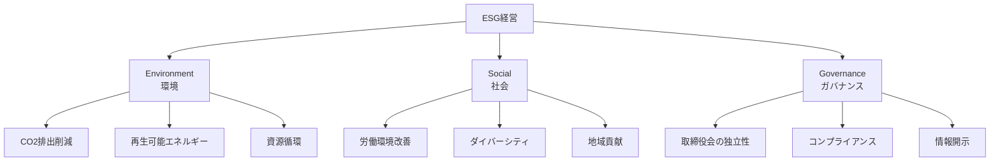

# ESG

## 導入問題

> あなたが投資を検討している2つの企業があります。A社は利益率が高いが環境汚染の問題を抱えており、B社は利益率は低いものの、環境保護や従業員の働きやすさで高く評価されています。
>
> 長期的な視点で、どちらの企業がより持続的な成長を遂げるでしょうか？

## 考えるポイント

- 短期的な利益と長期的な企業価値の関係
- 環境問題や社会問題が企業に与える影響
- ステークホルダー（株主、従業員、地域社会、顧客）からの信頼
- 規制強化や消費者意識の変化によるビジネスリスク

## 解説

### 用語定義

ESGとは、Environment（環境）、Social（社会）、Governance（ガバナンス）の頭文字を取った言葉です。企業の持続可能性や社会的責任を評価する際の3つの重要な観点を表します。

従来の財務指標だけでなく、これらの非財務情報を考慮することで、企業の長期的な価値やリスクをより包括的に評価できます。

### 背景・なぜ重要か

ESGが注目されるようになった背景には、次のような変化があります。

1. **気候変動問題の深刻化**: 温室効果ガス削減が企業の社会的責任に
2. **社会格差の拡大**: 労働環境や人権への関心の高まり
3. **企業不祥事の続発**: コンプライアンスやガバナンスの重要性が増大
4. **投資家の意識変化**: 長期的な視点で持続可能な企業への投資が拡大

ESG評価が高い企業は、リスク管理能力が高く、長期的に安定した成長が期待できるため、投資判断の重要な指標となっています。

## 詳細説明

### ESGの3つの要素

<!-- textlint-disable -->

<!-- textlint-enable -->

#### 1. Environment（環境）

企業活動が環境に与える影響を評価する観点です。

**主な評価項目**
- 温室効果ガス排出量の削減目標と実績
- 再生可能エネルギーの利用比率
- 水資源の管理と使用量削減
- 廃棄物のリサイクル率
- 生物多様性への配慮

#### 2. Social（社会）

企業が社会に対して果たす責任を評価する観点です。

**主な評価項目**
- 従業員の労働環境（労働時間、安全衛生）
- 人材育成への投資
- ダイバーシティ＆インクルージョン（性別、国籍、年齢の多様性）
- サプライチェーンにおける人権尊重
- 地域社会への貢献活動
- 製品・サービスの安全性と品質

#### 3. Governance（ガバナンス）

企業統治の健全性を評価する観点です。

**主な評価項目**
- 取締役会の構成（社外取締役の比率）
- 経営の透明性と情報開示
- コンプライアンス体制
- リスクマネジメント体制
- 株主との対話
- 役員報酬の適切性

### ESG投資の広がり

ESG投資とは、ESG評価を投資判断に組み込む投資手法です。

**ESG投資の規模**
- 世界のESG投資額は約35兆ドル（2020年時点）
- 欧州を中心に急拡大し、日本でも年金基金などが積極的に採用
- 運用資産全体の3分の1以上がESG投資に

**投資手法の種類**
- **ネガティブスクリーニング**: ESG評価が低い企業を除外
- **ポジティブスクリーニング**: ESG評価が高い企業を選定
- **エンゲージメント**: 株主として企業にESG改善を働きかける
- **インパクト投資**: 社会・環境問題の解決を目指す企業に投資

### CSRとの違い

CSR（Corporate Social Responsibility：企業の社会的責任）とESGは混同されがちですが、以下のような違いがあります。

| 項目 | CSR | ESG |
|------|-----|-----|
| 主体 | 企業側の自主的な取り組み | 投資家側の評価軸 |
| 焦点 | 社会貢献活動、慈善活動 | 企業価値・リスク評価 |
| 目的 | 社会への還元、企業イメージ向上 | 長期的な投資判断 |
| 測定 | 定性的な活動報告が中心 | 定量的な指標で評価 |

CSRは企業の「やっていること」を示すのに対し、ESGは投資家が企業を「どう評価するか」の基準といえます。

## 具体例・ケーススタディ

### 例1：再生可能エネルギーへの転換（Environment）

グローバル企業のAppleは、2030年までにサプライチェーン全体でカーボンニュートラルを達成する目標を掲げています。

**取り組み内容**
- 自社施設の電力を100%再生可能エネルギーに転換済み
- サプライヤーにも再生可能エネルギーの使用を要請
- 製品のリサイクル材料使用率を向上（iPhone 13では再生レアアースを使用）

**ビジネスへの影響**
- ブランドイメージの向上
- 環境規制への先行対応
- エネルギーコストの長期的な安定化

### 例2：ダイバーシティの推進（Social）

日本企業でも女性管理職の比率の向上や外国人人材の登用が進んでいます。

**資生堂の事例**
- 2030年までに女性管理職の比率50%を目標（2020年時点で約30%）
- 育児と仕事の両立支援制度の充実
- 多様な働き方を可能にする制度設計

**効果**
- 多様な視点による新商品開発
- 優秀な人材の獲得と定着率向上
- グローバル市場でのブランド力強化

### 例3：ガバナンス改革（Governance）

コーポレートガバナンス・コードの導入により、日本企業も社外取締役の選任が進んでいます。

**オムロンの事例**
- 取締役の過半数を社外取締役に
- 指名委員会・報酬委員会を設置
- 取締役会の実効性評価を毎年実施

**成果**
- 経営の透明性向上
- 迅速な意思決定
- 投資家からの信頼獲得

## ESG評価機関と評価方法

### 主要なESG評価機関

- **MSCI**: ESG格付けを提供（AAA～CCCの7段階）
- **FTSE Russell**: FTSE4Good Index Seriesなどの指数を算出
- **Sustainalytics**: ESGリスク評価を提供
- **CDP**: 環境情報開示プラットフォーム（気候変動、水、森林）

### 評価の課題

ESG評価には以下のような課題もあります。

- **評価基準の統一性**: 評価機関によって基準が異なる
- **データの信頼性**: 企業が開示する情報の正確性
- **業種による違い**: 業種特性を考慮した評価の必要性
- **短期vs長期**: 短期的なコストと長期的な便益のバランス

## 企業がESGに取り組む意義

### ビジネス上のメリット

1. **リスクマネジメント**: 環境・社会問題への対応遅れによる損失を回避
2. **資金調達の優位性**: ESG投資の拡大により、資金調達が有利に
3. **ブランド価値の向上**: 消費者や求職者からの評価向上
4. **イノベーション創出**: 社会課題解決が新たなビジネス機会に
5. **人材獲得**: 優秀な人材が働きたい企業になる

### ステークホルダーとの関係

<!-- textlint-disable -->

<!-- textlint-enable -->

## まとめ

ESGは、企業の持続可能性を評価する重要な指標として、投資家、企業、社会全体で注目されています。

**重要なポイント**
- Environment（環境）、Social（社会）、Governance（ガバナンス）の3つの観点
- 財務情報だけでなく非財務情報も企業価値を左右する時代に
- ESG評価が高い企業は長期的な成長が期待できる
- CSRは企業の取り組み、ESGは投資家の評価軸という違い
- リスク管理だけでなく、新たなビジネス機会の創出にもつながる

持続可能な社会の実現とビジネスの成功を両立させる経営が、今後ますます重要になっていくでしょう。

## 関連概念

- [CSV（共通価値の創造）](./CSV.md)
- [SDGs（持続可能な開発目標）](./SDGs.md)
- [ステークホルダー](../マネジメント/ステークホルダー.md)

## 参考文献

- 「ESG投資の研究」（加藤康之、2019年）
- GPIF（年金積立金の管理運用を行う独立行政法人）「ESG投資」
- 経済産業省「サステナブルな企業価値創造に向けた対話の実質化検討会」報告書
- [MSCI ESG Ratings](https://www.msci.com/our-solutions/esg-investing/esg-ratings)
