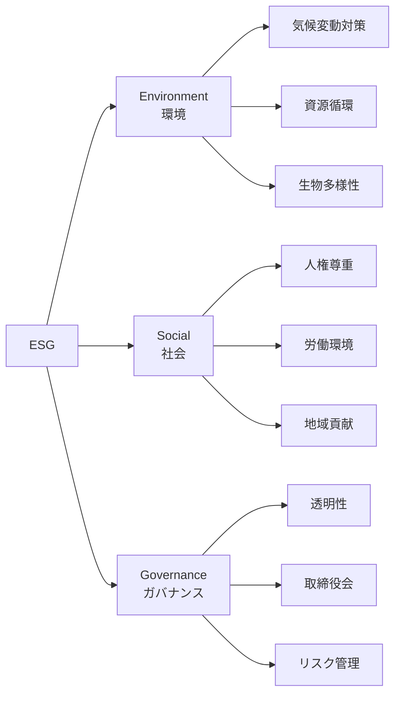
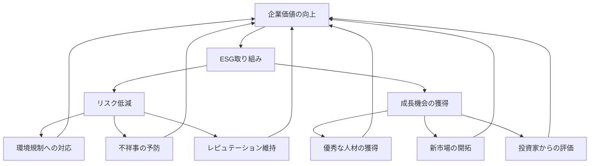

# ESG

## 導入問題

> 投資先を選ぶとき、あなたは何を基準にしますか？
>
> 売上や利益といった財務数字だけでしょうか。それとも、環境への配慮、従業員の働きやすさ、透明性のある経営といった「目に見えにくい要素」も重要だと感じますか？

## 考えるポイント

- 短期的な利益と長期的な企業価値は、必ずしも一致しない
- 環境破壊や不祥事は、企業の存続そのものを脅かすリスクになる
- 社会的責任を果たす企業ほど、優秀な人材を惹きつけられる
- 投資家は「持続可能な成長」をどのように評価しているのか

## 解説

### 用語定義

**ESG**とは、Environment（環境）、Social（社会）、Governance（ガバナンス）の頭文字を取った言葉です。企業の長期的な成長と持続可能性を評価するための、非財務的な3つの視点を指します。

<!-- textlint-disable -->

<!-- textlint-enable -->

### 背景・なぜ重要か

ESGが注目されるようになった背景には、いくつかの大きな変化があります。

**1. 気候変動や環境問題の深刻化**
企業活動が地球環境に与える影響が無視できなくなりました。CO2排出量の削減や再生可能エネルギーへの転換は、もはや企業の存続条件です。

**2. 社会的責任への意識の高まり**
労働環境、人権、ダイバーシティといった社会的課題への取り組みが、企業のブランド価値を左右するようになりました。

**3. コーポレートガバナンスの重要性**
不祥事や不正会計による企業価値の毀損を防ぐため、透明性のある経営体制が求められています。

投資家にとって、ESGは「リスク管理」と「成長機会の発見」という2つの意味を持ちます。ESG評価の低い企業は将来的なリスクを抱えています。逆にESGで優れた企業は長期的な成長が期待できるのです。

## 詳細説明

### E（Environment：環境）

環境分野では、以下のような項目が評価されます。

- **気候変動対策**：温室効果ガスの削減目標、再生可能エネルギーの利用
- **資源の効率的利用**：廃棄物の削減、リサイクル率の向上
- **生物多様性**：自然環境への影響低減、森林保全
- **水資源管理**：水使用量の削減、水質汚染の防止

例えば、製造業では工場のエネルギー効率化やサプライチェーン全体でのCO2削減が重要な取り組みとなります。

### S（Social：社会）

社会分野では、ステークホルダーとの関係性が評価されます。

- **労働環境**：労働安全衛生、ワークライフバランス
- **人材育成**：研修制度、キャリア開発
- **ダイバーシティ＆インクルージョン**：女性の管理職比率、障がい者雇用
- **人権尊重**：サプライチェーンでの人権デューデリジェンス
- **地域社会への貢献**：地域経済や社会への貢献活動

従業員エンゲージメントの高い企業ほど、生産性や定着率が向上するというデータもあります。

### G（Governance：ガバナンス）

ガバナンス分野では、企業統治の仕組みが評価されます。

- **取締役会の構成**：社外取締役の比率、多様性
- **監査機能**：内部監査、外部監査の独立性
- **情報開示**：財務情報・非財務情報の透明性
- **リスク管理体制**：コンプライアンス、内部統制
- **株主還元**：配当政策、自社株買い

適切なガバナンスは、不祥事の防止だけでなく、迅速で適切な意思決定を可能にします。

<!-- textlint-disable -->

<!-- textlint-enable -->

## ESG投資の現状

ESG投資とは、ESG要素を考慮して投資先を選定する投資手法です。世界的には、年金基金や機関投資家を中心に急速に拡大しています。

**主なESG投資手法**

1. **ネガティブスクリーニング**：武器製造、タバコなど特定業種を除外
2. **ポジティブスクリーニング**：ESG評価の高い企業を選定
3. **ESGインテグレーション**：財務分析にESG要素を組み込む
4. **エンゲージメント**：株主として企業に改善を働きかける
5. **インパクト投資**：社会的・環境的インパクトを重視

### ESG評価機関

企業のESGパフォーマンスは、専門の評価機関によってスコア化されています。

- **MSCI**：世界最大級のESG評価機関
- **FTSE Russell**：FTSE4Good指数を算出
- **S&P Global**：Dow Jones Sustainability Indexを提供
- **CDP**：気候変動・水・森林に関する情報開示を評価

評価機関により評価基準は異なります。そのため、同じ企業でもスコアにばらつきが出る場合もあります。

## CSRとの違い

ESGとよく混同される概念にCSR（Corporate Social Responsibility：企業の社会的責任）があります。

| 観点 | CSR | ESG |
|------|-----|-----|
| 主な対象 | 企業の社会貢献活動 | 投資判断の評価基準 |
| 視点 | 企業側の自主的な取り組み | 投資家側の評価視点 |
| 評価 | 定性的な報告が中心 | 定量的なスコア化 |
| 目的 | 社会への貢献 | 長期的な企業価値の向上 |

CSRは「企業が何をするか」に焦点を当てるのに対し、ESGは「投資家がどう評価するか」という視点です。CSRの取り組みがESG評価につながるという関係性があります。

## 企業がESGに取り組む意義

### 1. リスク管理

環境規制の強化、人権問題、ガバナンス不全は、企業の存続を脅かすリスクです。ESGへの取り組みは、これらのリスクを予防します。

### 2. 資金調達の円滑化

ESG評価の高い企業は、機関投資家からの投資を受けやすくなります。また、ESG債（グリーンボンドなど）による資金調達も可能です。

### 3. 優秀な人材の獲得

特にミレニアル世代・Z世代は、企業の社会的価値を重視する傾向があります。ESGに積極的な企業は、優秀な人材を惹きつけられます。

### 4. ブランド価値の向上

消費者もESGを重視するようになっています。環境に配慮した商品や社会的責任を果たす企業への支持が高まっています。

### 5. イノベーションの促進

環境問題や社会課題の解決は、新たなビジネスチャンスです。ESGへの取り組みが新製品・新サービスの開発につながります。

## 具体例・ケーススタディ

### 例1：自動車メーカーのE（環境）への取り組み

ある自動車メーカーは、2030年までに全車種を電動化する目標を掲げました。これには以下の取り組みが含まれます。

- EV（電気自動車）開発への大規模投資
- バッテリーのリサイクルシステムの構築
- サプライチェーン全体でのCO2排出量削減
- 再生可能エネルギーによる工場運営

この取り組みは、環境規制への対応であると同時に、EVという成長市場での競争力強化につながっています。

### 例2：IT企業のS（社会）への取り組み

あるIT企業は、多様性のある職場づくりに注力しています。

- 女性エンジニアの採用・育成プログラム
- フレックスタイム制度とリモートワークの推進
- 育児・介護との両立支援
- 障がい者の雇用促進と合理的配慮

結果として、従業員満足度が向上し、離職率が低下しました。また、多様な視点が製品開発にも良い影響を与えています。

### 例3：製造業のG（ガバナンス）強化

ある製造業では、不祥事を契機にガバナンス体制を刷新しました。

- 社外取締役の比率を過半数に引き上げ
- 内部通報制度の強化
- サプライヤー行動規範の策定と監査
- 統合報告書による透明性の向上

これにより投資家からの信頼を回復し、株価も回復基調となりました。

## ESGの課題と今後の展望

### 課題

1. **評価基準の不統一**：評価機関によって基準が異なり、比較が難しい
2. **グリーンウォッシング**：実態を伴わない表面的な取り組みの懸念
3. **短期と長期のバランス**：ESG投資の効果は長期で現れるため、短期志向との葛藤がある
4. **中小企業の対応**：ESG開示には一定のコストがかかり、中小企業には負担

### 今後の展望

- **規制の強化**：EUのサステナビリティ情報開示指令など、法規制が進む
- **評価の標準化**：国際的な情報開示基準の統一に向けた動き
- **技術の活用**：AI・ビッグデータによるESG分析の高度化
- **インパクト測定**：社会的・環境的インパクトの定量化手法の発展

ESGは単なる流行ではなく、企業経営の新しいスタンダードとして定着しつつあります。

## 関連概念

- SDGs（持続可能な開発目標）
- CSV（Creating Shared Value：共通価値の創造）
- サステナビリティ経営
- 統合報告

## 参考文献

- 水口剛『ESG投資 新しい資本主義のかたち』（日経BP、2017年）
- GPIFウェブサイト「ESG投資」https://www.gpif.go.jp/esg-stw/
- 経済産業省「サステナブルな企業価値創造に向けた対話の実質化検討会」報告書
