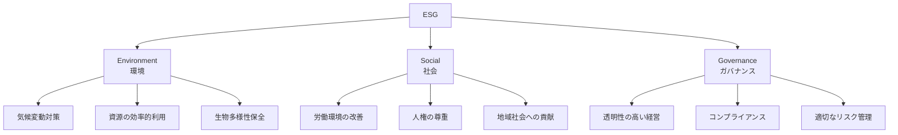
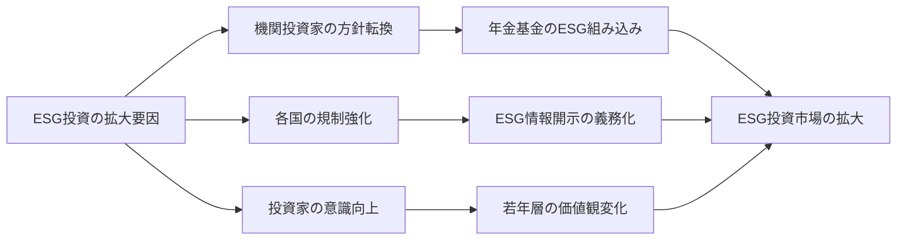
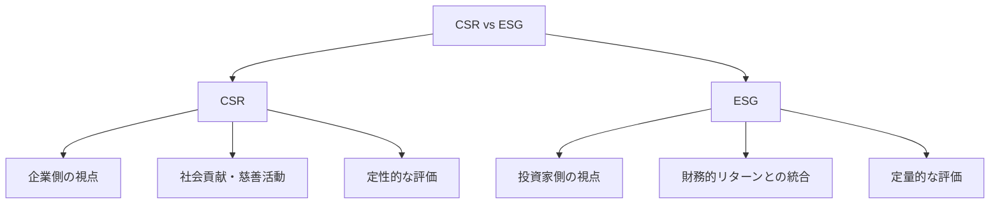
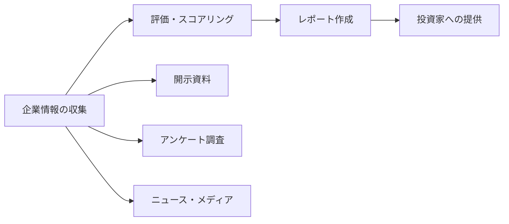

# ESG

## 導入問題

> あなたが投資家だとしたら、目先の利益を追求する企業と、環境保護や社会貢献に積極的に取り組む企業、どちらに投資したいですか？
>
> また、企業が長期的に成長し続けるためには、何が必要でしょうか？

## 考えるポイント

- 短期的な利益と長期的な価値創造の違い
- 企業を取り巻くステークホルダー（投資家、従業員、顧客、地域社会、環境）
- 社会的な要請や規制の変化が企業経営に与える影響
- 企業の評判やブランド価値が事業継続に与える影響

## 解説

### 用語定義

ESGとは、Environment（環境）、Social（社会）、Governance（ガバナンス）の3つの要素の頭文字を取った言葉です。企業の長期的な価値や持続可能性を評価する際の重要な指標として、投資家や経営者に注目されています。

<!-- textlint-disable -->

<!-- textlint-enable -->

### 背景・なぜ重要か

ESGが注目されるようになった背景には、以下のような社会的変化があります。

1. **気候変動問題の深刻化**: 地球温暖化による異常気象や自然災害の増加により、企業も環境問題への対応が求められるようになりました。

2. **社会的責任の高まり**: 労働環境、人権問題、格差問題など、企業が社会に与える影響への関心が高まっている。

3. **ガバナンス不全による企業不祥事**: 不適切な会計処理やコンプライアンス違反による企業価値の毀損が相次ぎました。

4. **機関投資家の意識変化**: 年金基金などの長期投資家が、短期的な利益よりも持続可能な価値創造を重視するようになりました。

## 詳細説明

### Environment（環境）

環境面では、以下のような評価項目があります。

- **気候変動対策**: CO2排出量の削減目標と実績、再生可能エネルギーの利用
- **資源管理**: 水資源の効率的利用、廃棄物削減、循環型経済への対応
- **生物多様性**: 自然資本への影響評価、生態系保全への取り組み
- **環境汚染防止**: 大気・水質汚染の管理、化学物質の適切な取り扱い

### Social（社会）

社会面では、以下のような評価項目があります。

- **労働慣行**: 労働安全衛生、適切な労働時間管理、公正な報酬
- **人材育成**: 従業員の能力開発、多様性の推進、ワークライフバランス
- **人権**: サプライチェーン全体での人権尊重、児童労働・強制労働の排除
- **地域社会**: 地域経済への貢献、社会貢献活動、ステークホルダーとの対話
- **製品責任**: 安全性の確保、品質管理、消費者保護

### Governance（ガバナンス）

ガバナンス面では、以下のような評価項目があります。

- **取締役会**: 独立した社外取締役の比率、多様性、専門性
- **監査機能**: 内部統制システム、監査体制の独立性と実効性
- **情報開示**: 財務・非財務情報の透明性、適時開示
- **株主権利**: 株主総会の運営、少数株主の権利保護
- **リスク管理**: 事業リスクの特定と管理、危機管理体制
- **コンプライアンス**: 法令遵守体制、倫理規定の整備と運用

## ESG投資の現状

ESG投資は、世界的な規模で急速に拡大している。

<!-- textlint-disable -->

<!-- textlint-enable -->

<!-- textlint-disable -->
特に欧州を中心として、ESG情報の開示を義務化する動きが加速している。日本でも東証プライム市場の上場企業に対して、TCFD（気候関連財務情報開示タスクフォース）に基づく開示が求められるなど、制度面での整備が進んでいる。
<!-- textlint-enable -->

## CSRとの違い

ESGとCSR（Corporate Social Responsibility：企業の社会的責任）は混同されがちですが、以下のような違いがあります。

<!-- textlint-disable -->

<!-- textlint-enable -->

**CSR（企業の社会的責任）**
- 企業が自主的に社会に貢献する活動
- 慈善活動や社会貢献が中心
- 企業側からの視点

**ESG**
- 投資判断や企業評価の指標
- 財務的なリターンと結びつけて評価
- 投資家側からの視点

ESGは、CSRの概念を包含しつつ、投資や経営戦略により深く結びついた枠組みといえる。

## 企業がESGに取り組む意義

企業がESGに取り組むことには、以下のようなメリットがあります。

### 1. リスク管理

環境規制の強化や人権問題への対応遅れは、企業に大きな損失をもたらします。ESGへの取り組みは、こうしたリスクを事前に低減できます。

### 2. 資金調達の円滑化

ESG評価が高い企業は、機関投資家からの投資を受けやすくなります。また、ESG債（グリーンボンド等）の発行など、新たな資金調達手段も利用できます。

### 3. 企業価値の向上

ESGへの取り組みは、ブランド価値や企業イメージの向上につながり、顧客や優秀な人材の獲得にも有利に働きます。

### 4. 事業機会の創出

環境技術や社会課題を解決するビジネスなど、ESGへの取り組みが新たな事業機会を生み出すこともある。

### 5. 長期的な競争力

持続可能な経営は、長期的な企業の競争力と成長の基盤となります。

## ESG評価機関と評価方法

ESG評価は、専門の評価機関が企業の開示情報やアンケート調査をもとに実施します。

### 主なESG評価機関

- **MSCI**: 世界的に広く利用されているESG評価
- **FTSE Russell**: FTSE4Good Indexなどを提供
- **Sustainalytics**: 詳細なESGリスク評価を実施
- **CDP**: 気候変動対応に特化した評価
- **日本取引所グループ**: JPX日経インデックス400などにESG要素を組み込み

### 評価のプロセス

<!-- textlint-disable -->

<!-- textlint-enable -->

1. **情報収集**: 企業の統合報告書、サステナビリティレポート、アンケート回答、ニュース等から情報を収集
2. **評価**: 業種特性を考慮しながら、各項目を定量的・定性的に評価
3. **スコアリング**: 総合スコアや各分野のスコアを算出
4. **開示**: 投資家向けにレポートやデータベースで提供

ただし、評価機関ごとに評価基準や重み付けは異なる。そのため、同じ企業でも評価結果は分かれる場合がある。

## 具体例・ケーススタディ

### 例1：自動車メーカーのEV戦略

ある自動車メーカーは、気候変動対策として電気自動車（EV）への大規模な投資を決定しました。これは、以下のようなESG観点から評価されます。

- **Environment**: CO2排出削減への貢献
- **Social**: 環境に優しい製品の提供
- **Governance**: 長期的な事業戦略の明確化

この取り組みにより、ESG投資家からの評価が向上し、株価にも好影響を与えました。

### 例2：アパレル企業のサプライチェーン改革

ある大手アパレル企業は、サプライチェーン全体での労働環境改善に取り組みました。

- 取引先工場の労働環境監査を実施
- 適正な賃金支払いの確認
- 児童労働の排除
- トレーサビリティの確保

当初はコスト増加が懸念されましたが、結果として以下の効果が得られました。

- ブランドイメージの向上
- ESG重視の投資家からの評価向上
- 倫理的消費を重視する顧客層の獲得

## 関連概念

- [CSR（企業の社会的責任）](./CSR.md)（※今後作成予定）
- [サステナビリティ](./サステナビリティ.md)（※今後作成予定）
- [SDGs](./SDGs.md)（※今後作成予定）
- [ステークホルダー](../ヒト/組織論/ステークホルダー.md)（※今後作成予定）

## 参考文献

<!-- textlint-disable -->
- 水口剛『ESG投資：新しい資本主義のかたち』（日本経済新聞出版、2021年）
- PRI（責任投資原則）公式サイト: https://www.unpri.org/
- GPIF（年金積立金管理運用独立行政法人）ESG投資: https://www.gpif.go.jp/investment/esg/
- 経済産業省「サステナブルな企業価値創造のための長期経営・長期投資に資する対話研究会」報告書
<!-- textlint-enable -->
