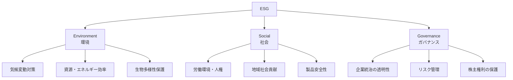
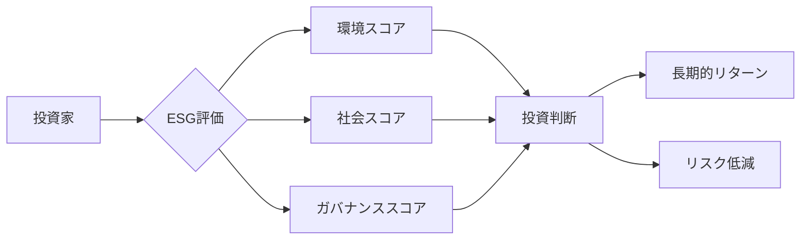

# ESG

## 導入問題

> あなたが投資家だとして、利益を出している企業Aと、利益はやや劣るが環境保護や社会貢献に積極的な企業Bがあります。
> どちらに投資すべきでしょうか？
> また、企業の価値は利益だけで測れるものでしょうか?

## 考えるポイント

- 短期的な利益と長期的な企業価値の違いは何か
- 環境問題や社会課題が企業に与える影響とは
- 投資家や消費者が企業に求めるものは変化しているか
- 企業の社会的責任とはどのようなものか

## 解説

### 用語定義

ESGとは、Environment（環境）、Social（社会）、Governance（ガバナンス）の3つの要素を指します。
企業の長期的な成長や持続可能性を評価する際の重要な指標として、投資判断や経営戦略に活用されています。

<!-- textlint-disable -->

<!-- textlint-enable -->

### 背景・なぜ重要か

ESGが注目されるようになった背景には、気候変動や人権問題などのグローバルな課題の深刻化があります。
2006年に国連が責任投資原則（PRI）を提唱し、ESGを考慮した投資が広まりました。

従来の財務情報だけでは企業の真の価値や将来性を測れないという認識が広がり、環境・社会・ガバナンスの観点から企業を評価する動きが加速しています。
ESGへの取り組みは、リスク管理や新たな事業機会の創出につながり、長期的な企業価値の向上に貢献します。

## 詳細説明

### Environment（環境）

環境面では、企業の事業活動が地球環境に与える影響を評価します。

**主な評価項目**
- CO2排出量の削減目標と実績
- 再生可能エネルギーの利用率
- 廃棄物削減とリサイクル
- 水資源の効率的利用
- 環境汚染対策

### Social（社会）

社会面では、企業が従業員、顧客、地域社会とどのように関わっているかを評価します。

**主な評価項目**
- ダイバーシティ＆インクルージョン
- 労働安全衛生
- 人材育成と働き方改革
- サプライチェーンにおける人権尊重
- 地域社会への貢献活動

### Governance（ガバナンス）

ガバナンス面では、企業の経営体制や意思決定プロセスの健全性を評価します。

**主な評価項目**
- 取締役会の独立性と多様性
- 情報開示の透明性
- 内部統制とコンプライアンス
- 株主との対話
- 役員報酬の適切性

### ESG投資の現状

世界のESG投資残高は急速に拡大しており、2020年時点で約35兆ドルに達しています。
機関投資家を中心に、ESGを投資判断に組み込む動きが加速しています。

<!-- textlint-disable -->

<!-- textlint-enable -->

### CSRとの違い

CSR（Corporate Social Responsibility：企業の社会的責任）とESGは混同されがちですが、明確な違いがあります。

| 項目 | CSR | ESG |
|------|-----|-----|
| 主体 | 企業側の自発的取り組み | 投資家からの評価視点 |
| 目的 | 社会貢献、企業イメージ向上 | 投資判断、リスク評価 |
| 測定 | 定性的な活動報告が中心 | 定量的な指標で評価 |
| 範囲 | 社会貢献活動が中心 | 環境・社会・ガバナンスを包括 |

CSRは企業が「何をするか」という活動そのものを指すのに対し、ESGは投資家が「どう評価するか」という視点を提供します。

## 具体例・ケーススタディ

### 例1：再生可能エネルギー企業への転換

ある欧州のエネルギー企業は、化石燃料から再生可能エネルギーへの転換を宣言しました。
短期的には投資コストが増大しましたが、ESG評価の向上により機関投資家からの資金流入が増え、株価は長期的に上昇しました。
環境規制の強化を先取りすることで、競合他社に対する優位性も獲得しています。

### 例2：サプライチェーンにおける人権配慮

大手アパレル企業が、発展途上国の工場における労働環境改善に取り組みました。
第三者機関による監査を導入し、児童労働の排除や安全な労働環境の確保を実施しています。
これにより消費者からの信頼が向上し、ブランド価値の向上につながっています。

### 例3：取締役会の多様性向上

テクノロジー企業が取締役会に女性や異なるバックグラウンドを持つメンバーを積極的に登用しました。
多様な視点から意思決定が行われるようになり、イノベーションの促進や新市場の開拓に成功しています。
ガバナンススコアの向上により、ESG投資ファンドからの投資対象としても選ばれるようになりました。

## ESG評価機関と評価方法

### 主要な評価機関

- **MSCI ESG Ratings**：世界最大級のESG評価機関
- **Sustainalytics**：企業のESGリスクを評価
- **FTSE Russell**：ESG指数の提供
- **CDP**：環境情報開示に特化

### 評価プロセス

1. 公開情報の収集（統合報告書、サステナビリティレポート等）
2. 業界ごとの重要項目の特定
3. スコアリングとランク付け
4. 定期的な見直しと更新

評価機関によって評価基準や重視する項目が異なるため、企業は複数の評価を参考にする必要があります。

## 企業がESGに取り組む意義

### リスク管理

環境規制の強化や社会課題への対応遅れは、企業にとって大きなリスクとなります。
ESGへの取り組みは、これらのリスクを事前に回避・軽減する効果があります。

### 事業機会の創出

環境技術や社会課題を解決するビジネスは、新たな成長市場として期待されています。
ESGを経営戦略に組み込むことで、イノベーションや新規事業の創出につながります。

### 資金調達の円滑化

ESG評価が高い企業は、機関投資家からの投資を受けやすくなります。
また、ESG債（グリーンボンド、ソーシャルボンド）による資金調達も可能になります。

### 人材の獲得・定着

特に若い世代は、社会的意義のある企業で働きたいという志向が強くなっています。
ESGへの取り組みは、優秀な人材の獲得と定着に寄与します。

## 今後の展望

ESG投資は今後さらに拡大すると予想されています。
欧州を中心にESG情報開示の義務化が進んでいます。
日本でも2022年、プライム市場上場企業はTCFD提言に基づく気候変動の情報開示が実質義務化されました。

企業にとって、ESGは任意の取り組みではなく、経営の根幹に関わる必須要素となりつつあります。
短期的な利益追求だけでなく、長期的な視点で環境・社会・ガバナンスに配慮した経営が求められています。

## 関連概念

- CSR（企業の社会的責任）
- SDGs（持続可能な開発目標）
- サステナビリティ経営
- ステークホルダー資本主義

## 参考文献

- 国連の責任投資原則（PRI）公式サイト
- MSCI ESG Research
- 経済産業省「サステナブルな企業価値創造のための長期経営・長期投資に資する対話研究会」報告書
- TCFD（気候関連の財務情報開示タスクフォース）提言
