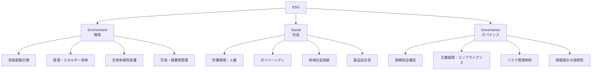
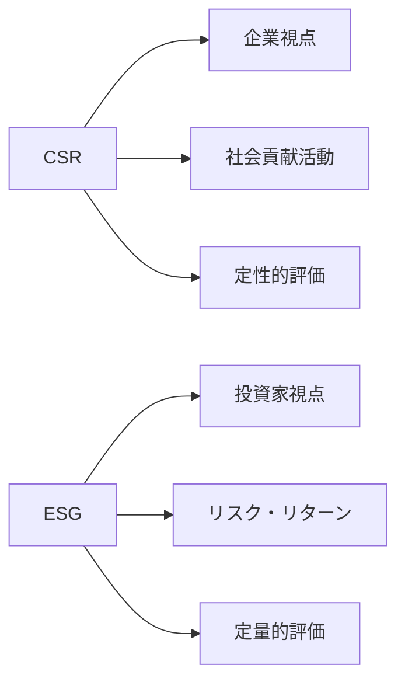

# ESG

## 導入問題

> あなたが投資家だとして、2つの企業があります。
> 一方は財務数値は優秀だが環境問題で度々批判される企業、もう一方は財務数値はやや劣るが社会貢献に積極的な企業。
> どちらに投資すべきでしょうか?

## 考えるポイント

- 短期的な利益と長期的な持続可能性のどちらを重視するか
- 企業が社会に与える影響はビジネスの成功にどう関わるか
- 環境や社会問題が企業価値に与えるリスクとは何か
- 投資家や消費者は企業に何を求めているのか

## 解説

### 用語定義

ESGとは、Environment（環境）、Social（社会）、Governance（ガバナンス）の3つの観点から企業を評価する枠組みです。
従来の財務情報だけでなく、非財務情報を含めた多面的な評価により、企業の持続可能性や中長期的な価値創造力を測定します。

### 背景・なぜ重要か

21世紀に入り、気候変動、人権問題、企業不祥事などが企業経営に大きな影響を与えるようになりました。
2006年に国連が「責任投資原則（PRI）」を提唱して以降、ESGは投資判断の重要な指標となっています。

ESGが重要視される理由：

- **リスク管理**: 環境規制強化や社会的評判の悪化は事業継続リスクになる
- **投資機会**: ESGへの取り組みが新たなビジネスチャンスを生む
- **ステークホルダー要請**: 投資家、消費者、従業員がESGへの配慮を求めている
- **長期的な価値創造**: 持続可能な経営が企業の長期的成長につながる

## 詳細説明

ESGの3つの要素について詳しく見ていきましょう。

<!-- textlint-disable -->

<!-- textlint-enable -->

### Environment（環境）

企業の環境への影響と対策を評価します。

**主な評価項目**:
- CO2排出量の削減目標と実績
- 再生可能エネルギーの利用率
- 水資源の管理
- 廃棄物のリサイクル率
- 環境に配慮した製品の開発

### Social（社会）

企業と社会の関係性を評価します。

**主な評価項目**:
- 労働安全衛生
- 人権尊重とサプライチェーン管理
- 従業員の多様性と機会均等
- 地域社会への貢献
- 顧客データ保護とプライバシー

### Governance（ガバナンス）

企業統治の健全性を評価します。

**主な評価項目**:
- 取締役会の独立性と多様性
- 役員報酬の適切性
- 内部統制システム
- 株主権利の保護
- 情報開示の質と透明性

## ESG投資の現状

ESG投資は世界的に急成長しています。

**主なESG投資手法**:

1. **ネガティブスクリーニング**: 武器、タバコなど特定業種を除外
2. **ポジティブスクリーニング**: ESG評価の高い企業を選定
3. **ESGインテグレーション**: 投資分析にESG要素を組み込む
4. **エンゲージメント**: 株主として企業にESG改善を働きかける
5. **インパクト投資**: 社会課題解決を目的とした投資

## CSRとの違い

ESGとCSR（企業の社会的責任）は混同されがちですが、明確な違いがあります。

<!-- textlint-disable -->

<!-- textlint-enable -->

| 観点 | CSR | ESG |
|------|-----|-----|
| 主体 | 企業が自主的に取り組む | 投資家が企業を評価する |
| 目的 | 社会への貢献、企業イメージ向上 | 投資判断、リスク管理 |
| 評価 | 定性的な活動報告が中心 | 定量的なデータと指標 |
| 範囲 | 慈善活動や社会貢献が中心 | 経営全体に関わる包括的評価 |

## 企業がESGに取り組む意義

ESGへの取り組みは、コストではなく投資として捉えるべきです。

**具体的なメリット**:

1. **資金調達の優位性**: ESG評価が高いと機関投資家から選ばれやすい
2. **リスク低減**: 環境規制違反や不祥事のリスクを未然に防ぐ
3. **ブランド価値向上**: 消費者や優秀な人材からの支持を得る
4. **イノベーション促進**: 環境・社会課題への対応が新製品開発につながる
5. **従業員エンゲージメント**: 社会的意義のある仕事が社員のモチベーションを高める

## ESG評価機関と評価方法

世界には複数のESG評価機関があり、それぞれ独自の評価基準を持っています。

**主なESG評価機関**:

- **MSCI**: 世界最大級のESG評価機関、AAAからCCCまでの7段階評価
- **FTSE Russell**: FTSE4Good Indexシリーズを提供
- **Sustainalytics**: リスクベースのESG評価を提供
- **S&P Global**: 業種別の詳細なESG分析
- **CDP**: 気候変動、水、森林に特化した評価

**評価の課題**:
- 評価機関によって基準は異なり、結果にばらつきがある
- 業種特性を十分に反映できていない場合がある
- 定量データの入手は難しい項目もある

## 具体例・ケーススタディ

### 例1：自動車メーカーのESG戦略

ある自動車メーカーは、以下のESG戦略を推進しています。

**E（環境）**: 2030年までに電気自動車の販売比率を50%に引き上げます。
工場のCO2排出量を80%削減します。
**S（社会）**: サプライチェーン全体での人権デューデリジェンス実施、女性の管理職比率30%達成。
**G（ガバナンス）**: 社外の取締役比率を50%に引き上げ、気候変動リスクを取締役会で四半期ごとに議論。

結果として、ESG投資ファンドからの資金流入が増加し、株価も安定的に推移しています。

### 例2：小売業のサステナビリティ経営

大手小売チェーンは、ESGを経営の中核に据えています。

**E（環境）**: プライベートブランド製品のパッケージを100%リサイクル可能な素材に変更。
**S（社会）**: サプライヤーの労働環境監査を強化。
フェアトレード商品の品揃えを拡大。
**G（ガバナンス）**: サステナビリティ委員会を設置。
四半期ごとに進捗を株主に報告。

これにより、環境意識の高い若年層顧客の支持を獲得し、売上増加につながっています。

## 関連概念

- [CSR（企業の社会的責任）](./CSR.md)（今後作成予定）
- [SDGs（持続可能な開発目標）](./SDGs.md)（今後作成予定）
- [ステークホルダー](./ステークホルダー.md)（今後作成予定）

## 参考文献

- 国連の責任投資原則（UN PRI）ウェブサイト
- 経済産業省「サステナブルな企業価値創造に向けた対話の実質化検討会」報告書
- 『ESG投資とは何か』（日本経済新聞の出版、2020年）
- MSCI ESG Research ウェブサイト
